# PreztiaOS — Documento de Arquitectura

> **Estado:** documento vivo. Se ajusta conforme se toman decisiones.
> **Última actualización:** 2026-06-06 (añadidos atributos de calidad y estándares de código — §3)
> **Ámbito:** plataforma multi-tenant de **préstamos y cobranza** (microcrédito de ruta/gota a gota, cobranza por zonas).

---

## Tabla de contenido

1. [Visión del producto](#1-visión-del-producto)
2. [Principios de arquitectura](#2-principios-de-arquitectura)
3. [Atributos de calidad y estándares de código](#3-atributos-de-calidad-y-estándares-de-código)
4. [Vista de contexto (C4 nivel 1)](#4-vista-de-contexto-c4-nivel-1)
5. [Vista de contenedores (C4 nivel 2)](#5-vista-de-contenedores-c4-nivel-2)
6. [Estructura del monorepo](#6-estructura-del-monorepo)
7. [Arquitectura en capas (hexagonal / DDD)](#7-arquitectura-en-capas-hexagonal--ddd)
8. [Multitenancy y seguridad (RLS)](#8-multitenancy-y-seguridad-rls)
9. [Modelo de datos](#9-modelo-de-datos)
10. [Zonificación con `ltree`](#10-zonificación-con-ltree)
11. [Contract-first (ts-rest + zod)](#11-contract-first-ts-rest--zod)
12. [Flujo de un caso de uso: otorgar crédito](#12-flujo-de-un-caso-de-uso-otorgar-crédito)
13. [El dominio: dinero y calendario de cuotas](#13-el-dominio-dinero-y-calendario-de-cuotas)
14. [Clientes: app móvil/web (Expo)](#14-clientes-app-móvilweb-expo)
15. [Infraestructura local](#15-infraestructura-local)
16. [Build, tooling y pipeline](#16-build-tooling-y-pipeline)
17. [Integración continua (CI)](#17-integración-continua-ci)
18. [Convenciones del proyecto](#18-convenciones-del-proyecto)
19. [Bounded contexts y roadmap](#19-bounded-contexts-y-roadmap)
20. [Registro de decisiones (ADR)](#20-registro-de-decisiones-adr)
21. [Deuda técnica y riesgos](#21-deuda-técnica-y-riesgos)
22. [Glosario](#22-glosario)

---

## 1. Visión del producto

PreztiaOS es un sistema **multi-tenant** (varias empresas/operadores aislados en una sola instancia) para gestionar:

- **Préstamos** de bajo monto con cuotas frecuentes (diario, semanal, quincenal, mensual).
- **Cobranza por zonas geográficas/jerárquicas**, con coordinadores y cobradores asignados a un subárbol de zonas.
- **Conciliación de caja** diaria y liquidación.
- **Conversaciones automatizadas** (WhatsApp) para recordatorios y gestión de cobro.
- **Reportería** (dashboards, mapas) sobre modelos de lectura.

El núcleo del diseño se apoya en tres pilares:

| Pilar | Cómo se materializa |
|---|---|
| **Aislamiento fuerte entre tenants** | Row-Level Security (RLS) en PostgreSQL + rol de aplicación sin privilegios de bypass. |
| **Tipado de punta a punta** | Un único paquete de contratos (`ts-rest` + `zod`) compartido por API y clientes. |
| **Dominio rico y testeable** | Lógica de negocio (dinero, calendario de cuotas) en paquetes puros, sin framework ni I/O. |

---

## 2. Principios de arquitectura

1. **Arquitectura hexagonal (puertos y adaptadores).** El dominio y los casos de uso no conocen NestJS, Drizzle ni HTTP. La infraestructura implementa interfaces (*puertos*) definidas por la capa de aplicación.
2. **Domain-Driven Design.** Cada funcionalidad arranca con su **spec** (Gherkin) → prueba de dominio → implementación. Bounded contexts explícitos (IAM, Zoning, Borrowers, Credit, Cash, Conversations, Reporting).
3. **Contract-first.** El contrato HTTP es la fuente única de verdad; tanto el servidor (NestJS) como los clientes (web/móvil) derivan sus tipos del mismo paquete.
4. **Seguridad por defecto / defense-in-depth.** El aislamiento de tenant no depende de que el código “recuerde” filtrar: lo garantiza la base de datos vía RLS `FORCE`.
5. **Dinero como enteros.** Todo importe se maneja en **unidades menores** (centavos) para evitar errores de coma flotante.
6. **Monorepo con límites claros.** `packages/*` reutilizables y agnósticos; `apps/*` componen e integran.
7. **CQRS-ready.** La escritura va por agregados de dominio; la lectura (reporting) usará *read models* dedicados más adelante.

---

## 3. Atributos de calidad y estándares de código

> **Regla vinculante.** Esta sección define los **atributos de calidad** que rigen *todo* el código del proyecto. **Todo algoritmo, caso de uso o módulo futuro debe cumplirla** y demostrar que es **correcto** (ver §3.6). No son recomendaciones: son **criterios de aceptación** de cualquier PR y parte obligatoria de la revisión de código.

Los cuatro atributos que perseguimos, en orden de aplicación al escribir código:

| Atributo | Qué significa aquí | Cómo se verifica |
|---|---|---|
| **Responsabilidad única (SRP)** | cada unidad tiene una sola razón para cambiar | revisión + límites de capa (§7) |
| **Código limpio** | sin duplicación, sin números mágicos, errores explícitos | lint + revisión |
| **Código entendible** | se lee como prosa; intención evidente sin comentarios de relleno | revisión de pares |
| **Código mantenible** | cambiar/extender es barato y de bajo riesgo | pruebas + acoplamiento bajo |

### 3.1 Principio de responsabilidad única (SRP)

Cada módulo, clase o función tiene **una sola razón para cambiar**. En este proyecto se traduce en una asignación estricta de responsabilidades por capa:

| Pieza | **Sí** hace | **No** hace |
|---|---|---|
| **Controller** (`*.controller.ts`) | valida la frontera HTTP (zod) y delega | reglas de negocio, SQL |
| **Caso de uso** (`*Handler`) | orquesta dominio + puertos, define la transacción | validar HTTP, armar SQL, calcular reglas |
| **Dominio** (`Money`, `buildSchedule`) | reglas puras e invariantes | I/O, conocer NestJS/Drizzle/HTTP |
| **Repositorio** (`*Repository`) | traduce dominio ↔ persistencia | reglas de negocio |
| **Contrato** (`@preztiaos/contracts`) | forma y validación del API | lógica de dominio o infra |

> 🚨 **Señales de violación del SRP:** nombres con “y”/`Manager`/`Util` genéricos; funciones de más de ~40 líneas o con varios niveles de abstracción mezclados; una clase que importa de capas distintas (p. ej. dominio que importa Drizzle); un `if` que decide *qué* hacer y *cómo* hacerlo a la vez.

### 3.2 Código limpio (clean code)

- **Nombres reveladores de intención.** El nombre dice *qué* y *por qué*, no *cómo*. Identificadores en inglés, dominio/comentarios en español (§18).
- **Funciones pequeñas y de un solo nivel de abstracción.** Una función hace una cosa; si necesita un comentario para separar “bloques”, son funciones distintas.
- **Sin números mágicos.** Constantes con nombre (p. ej. la base-mil del interés, no `200` suelto).
- **Sin duplicación (DRY).** La lógica vive en un solo lugar; el reuso pasa por `packages/*`.
- **Errores explícitos.** Lanzar `DomainError` con mensaje claro; **prohibido** `catch` vacío o tragarse errores. La validación de entrada ocurre en la frontera (zod); el dominio asume datos válidos.
- **Inmutabilidad por defecto.** Los objetos de valor son inmutables (`Money` devuelve nuevas instancias; nunca muta).
- **Sin código muerto ni `console.log` de depuración** en lo que se mergea.

### 3.3 Código entendible (legibilidad)

- El código se lee de arriba abajo como una narración del caso de uso.
- **Comentarios que explican el porqué**, no el qué (el qué lo dice el código). Documentar invariantes y decisiones no obvias (p. ej. “la última cuota absorbe el redondeo”).
- Una sola forma de hacer cada cosa (consistencia con las convenciones de §18).
- Tipos explícitos en las fronteras públicas; evitar `any` (ver deuda `tx: any` en §21).
- Estructura predecible: un *slice* nuevo replica la estructura del *slice* de crédito (contrato → controlador → caso de uso → dominio → repo).

### 3.4 Código fácil de mantener (mantenibilidad)

- **Bajo acoplamiento / alta cohesión:** se logra con la inversión de dependencias (§7); el dominio y la aplicación no dependen de framework ni de infraestructura.
- **Dependencias solo “hacia abajo”** (regla de oro, §6): apps → packages, application → domain.
- **Pruebas como red de seguridad:** todo cambio de comportamiento se cubre con prueba (dominio puro primero); el invariante de negocio se vuelve test (p. ej. `Σ cuotas === total`).
- **Cambios localizados:** añadir una regla no debe obligar a tocar varias capas; si lo hace, revisar el diseño.
- **Configuración fuera del código:** secretos y entornos por variables (`.env`), nunca hardcodeados (ver placeholders en §21).

### 3.5 Checklist obligatorio para cada nuevo algoritmo / caso de uso

Antes de marcar como “listo”, todo algoritmo o caso de uso nuevo debe poder responder **sí** a:

- [ ] Arrancó por su **spec (Gherkin) → prueba de dominio → implementación** (DDD, §2).
- [ ] Cada pieza respeta el **SRP** (tabla §3.1); no cruza límites de capa.
- [ ] Las **reglas de negocio están en el dominio puro**, sin I/O ni framework.
- [ ] La **entrada se valida en la frontera** (zod del contrato); el dominio asume datos válidos.
- [ ] Los **invariantes** están enunciados y cubiertos por **pruebas** (ver §3.6).
- [ ] **Dinero en unidades menores** (entero), sin coma flotante (§2, principio 5).
- [ ] Respeta **multitenancy**: toda escritura va por `withTenantTx`; toda tabla lleva `tenant_id`.
- [ ] Sin **números mágicos**, sin **duplicación**, errores **explícitos**, nombres **reveladores**.
- [ ] Pasa **typecheck + lint + test + build** (§17) en verde.

### 3.6 Definición de “correcto” (corrección verificable)

Un algoritmo es **correcto** solo si su corrección es **demostrable y verificada**, no asumida:

1. **Invariantes explícitos.** Se enuncian las propiedades que siempre deben cumplirse (ej.: `Σ amountDueMinor === total.amountMinor`).
2. **Pruebas que los verifican.** Cada invariante y cada caso borde (cero, redondeo, monedas distintas, valores límite) tiene una prueba automatizada.
3. **Determinismo y manejo de bordes.** Entradas inválidas fallan rápido con `DomainError`; no hay estados silenciosamente incorrectos.
4. **Verde en CI.** La corrección se considera establecida solo cuando las pruebas pasan en el pipeline (§17), no en la máquina local.

> En resumen: **no se mezcla responsabilidades, se escribe limpio y legible, se diseña para el cambio, y se prueba la corrección.** Cualquier código que no cumpla estos cuatro atributos se considera incompleto.

### 3.7 Atributos de calidad del sistema (-ilities)

Los §3.1–§3.6 son atributos a **nivel de código**. Esta sección añade los atributos a **nivel de sistema** que, por tratarse de una plataforma **fintech multi-tenant** (dinero, deudores, multiusuario), son tan obligatorios como los anteriores. Cada algoritmo o caso de uso futuro debe considerarlos y dejar explícita su estrategia.

#### Críticos (dinero + multi-tenant)

| Atributo | Qué exigimos (reglas accionables) | Estado / referencia |
|---|---|---|
| **Seguridad** | aislamiento por RLS `FORCE` + rol `app`; identidad del tenant desde **JWT** (no header spoofable), 401 si falta; authZ por rol y por subárbol de zonas (`ZoneScopeGuard`); secretos solo por entorno; validación en la frontera (zod) | ⚠️ RLS ✅; authN/authZ y tenant-por-JWT pendientes (§8, §21) |
| **Auditabilidad / trazabilidad** | **todo movimiento de dinero y cambio de estado** se registra en un **audit log append-only** (quién, qué, cuándo, tenant); `correlationId` por petición; nada de borrar/editar historial financiero | ❌ por diseñar |
| **Confiabilidad / idempotencia** | toda operación de dinero y todo webhook (WhatsApp) es **idempotente** (clave de idempotencia / `dedup`); reintentos seguros; consistencia transaccional (`withTenantTx`); sin doble cobro/abono | ⚠️ transacciones ✅; idempotencia pendiente |
| **Integridad / corrección financiera** | invariantes de agregado (saldo nunca negativo, `Σ abonos ≤ total`, cuadre de caja); dinero en enteros (`Money`); invariantes verificados con pruebas (§3.6) | ⚠️ `Money` + cuadre de cuotas ✅; invariantes de agregado/caja pendientes |

#### Operación

| Atributo | Qué exigimos (reglas accionables) | Estado / referencia |
|---|---|---|
| **Observabilidad** | logs **estructurados** (JSON) con `tenantId` + `correlationId`; métricas de negocio y técnicas; *tracing* de extremo a extremo; sin PII en logs | ❌ por diseñar |
| **Disponibilidad / resiliencia** | timeouts y **reintentos con backoff** hacia servicios externos (WhatsApp, mapas); *circuit breaker*; degradación elegante; colas (Redis) para desacoplar picos | ⚠️ Redis previsto; políticas pendientes |
| **Rendimiento / escalabilidad** | índices adecuados (GiST en `ltree` ✅); **paginación obligatoria** en listados; evitar N+1; trabajo pesado (cobro masivo, notificaciones) a colas; *read models* (CQRS) para reportería | ⚠️ parcial (§9, §2 CQRS-ready) |
| **Privacidad / cumplimiento** | datos personales de deudores y KYC: **cifrado en reposo** (MinIO), control de acceso, política de retención y minimización; no exponer PII en API/logs | ❌ por diseñar |

> Estos atributos se conectan con la [§21 Deuda técnica](#21-deuda-técnica-y-riesgos): varios (validación de tenant, pruebas de aislamiento) ya están listados como pendientes y son la materialización de estas exigencias.

---

## 4. Vista de contexto (C4 nivel 1)

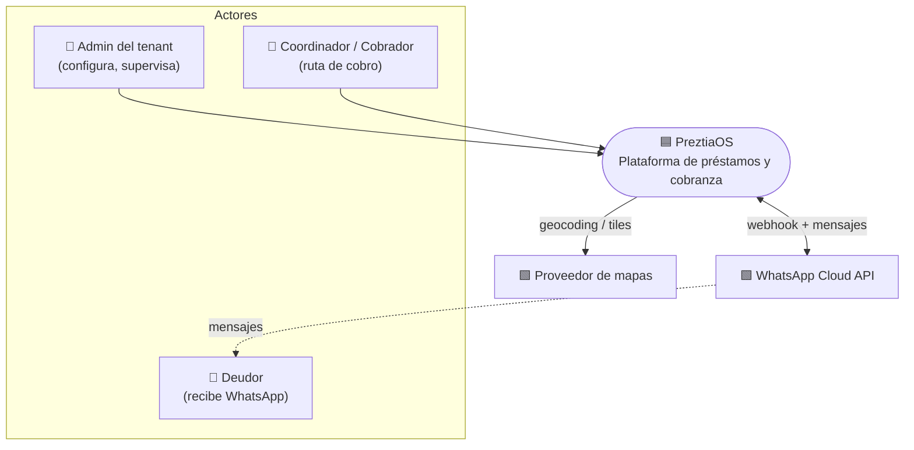

---

## 5. Vista de contenedores (C4 nivel 2)

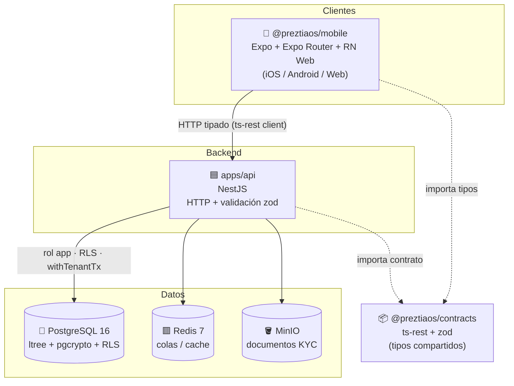

> **Nota:** la API y la web usan por defecto el puerto **3000**. Para correr ambas en local, cambia el puerto de la web (`-- -p 3001`) o el de la API (`PORT=3001`).

---

## 6. Estructura del monorepo

Gestionado con **pnpm workspaces** + **Turborepo**. Scope canónico de los paquetes: **`@preztiaos`**.

```
preztia/
├─ apps/
│  ├─ api/                 # NestJS (HTTP, middleware de tenant, repos Drizzle)
│  └─ mobile/              # Expo (iOS/Android/Web) — Expo Router + NativeWind
├─ packages/
│  ├─ config/             # @preztiaos/config — tsconfig.base.json, eslint.base.cjs
│  ├─ domain/             # @preztiaos/domain — lógica pura (Money, buildSchedule)
│  ├─ application/        # @preztiaos/application — casos de uso + puertos
│  ├─ contracts/          # @preztiaos/contracts — ts-rest + zod (fuente de tipos)
│  └─ db/                 # @preztiaos/db — Drizzle schema, migraciones, createDb
├─ docker/initdb/          # 01-init.sql (extensiones, rol app, grants)
├─ docs/                   # 📄 este documento
├─ docker-compose.yml      # pg + redis + minio
├─ turbo.json              # pipeline de tareas
├─ pnpm-workspace.yaml
└─ .npmrc                  # node-linker=hoisted (requerido por Metro/Expo)
```

### Grafo de dependencias entre paquetes

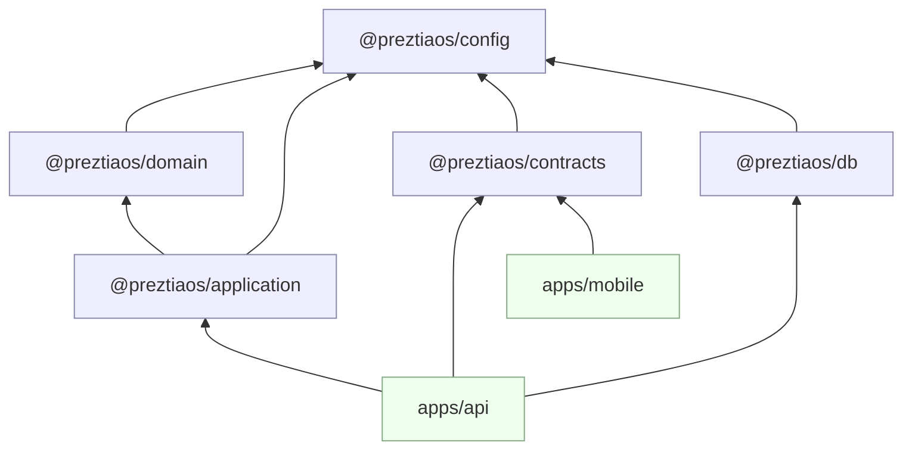

**Regla de oro de dependencias:** las flechas solo apuntan “hacia abajo” (apps → packages, application → domain). El dominio no depende de nadie de negocio salvo `config`.

---

## 7. Arquitectura en capas (hexagonal / DDD)

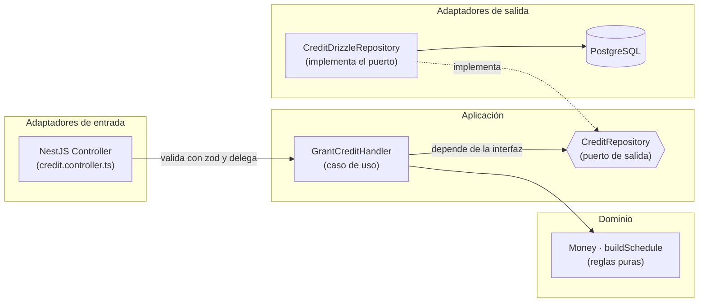

| Capa | Paquete | Conoce a… | NO conoce a… |
|---|---|---|---|
| **Dominio** | `@preztiaos/domain` | nada externo | aplicación, infra, HTTP |
| **Aplicación** | `@preztiaos/application` | dominio + sus propios puertos | NestJS, Drizzle, HTTP |
| **Contratos** | `@preztiaos/contracts` | zod | dominio/infra |
| **Infraestructura** | `apps/api/*`, `@preztiaos/db` | aplicación, contratos, Drizzle | — |
| **Presentación** | `apps/mobile` | contratos | dominio, db |

**Inversión de dependencias en acción** ([grant-credit.ts](../packages/application/src/credit/grant-credit.ts)):

```ts
// La aplicación DECLARA lo que necesita (puerto), no cómo se hace.
export interface CreditRepository {
  save(credit: { id: string; tenantId: string; principalMinor: number; currency: string }): Promise<void>;
}

export class GrantCreditHandler {
  constructor(private readonly credits: CreditRepository) {} // recibe la implementación
  async execute(cmd: GrantCreditCommand) { /* usa dominio + puerto */ }
}
```

La infraestructura ([credit.repository.ts](../apps/api/src/credit/credit.repository.ts)) implementa ese puerto con Drizzle, sin que el dominio se entere.

---

## 8. Multitenancy y seguridad (RLS)

El aislamiento entre tenants es la **propiedad de seguridad más importante** del sistema y se garantiza en **tres niveles**:

1. **Identificación del tenant** — middleware que lo extrae (hoy de un header `x-tenant-id`; en producción del JWT/subdominio) y lo guarda en un `AsyncLocalStorage`.
2. **Propagación por transacción** — cada operación se ejecuta dentro de `withTenantTx`, que fija `app.current_tenant` con `set_config(..., true)` (alcance de transacción).
3. **Aplicación en la base de datos** — políticas RLS con `FORCE ROW LEVEL SECURITY` que filtran por `tenant_id = current_setting('app.current_tenant')`. La app se conecta con el rol **`app`** (`NOSUPERUSER NOBYPASSRLS`), así que **no puede** saltarse el filtro aunque el código tenga un bug.

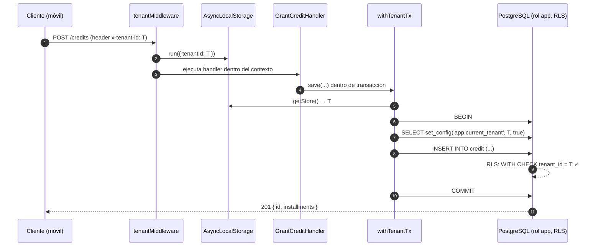

**Política RLS aplicada** (de [0001_rls_and_ltree.sql](../packages/db/migrations/0001_rls_and_ltree.sql)), repetida por cada tabla con `tenant_id`:

```sql
ALTER TABLE credit ENABLE ROW LEVEL SECURITY;
ALTER TABLE credit FORCE  ROW LEVEL SECURITY;   -- aplica incluso al dueño de la tabla
CREATE POLICY tenant_isolation ON credit
  USING      (tenant_id = current_setting('app.current_tenant')::uuid)
  WITH CHECK (tenant_id = current_setting('app.current_tenant')::uuid);
```

**Separación de roles de conexión:**

| Variable | Rol | Uso |
|---|---|---|
| `DATABASE_URL` | `preztia` (dueño del esquema) | **migraciones** (DDL) |
| `APP_DATABASE_URL` | `app` (sin bypass de RLS) | **runtime de la aplicación** |

> ⚠️ Si la app se conecta por error con el rol dueño, RLS `FORCE` igual aplica, pero la regla operativa es: **runtime siempre con `app`**.

> 🔒 **Red de seguridad pendiente (CI):** pruebas de aislamiento con Testcontainers como *status check* obligatorio — insertar con tenant A y verificar que una consulta con `app.current_tenant = B` no lo ve.

---

## 9. Modelo de datos

Estado actual del esquema Drizzle ([packages/db/src/schema](../packages/db/src/schema)). Todas las tablas de negocio llevan `tenant_id` (clave del aislamiento RLS).

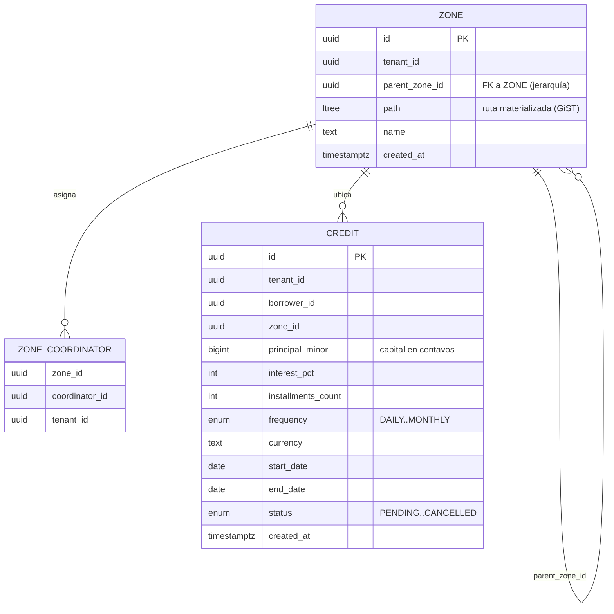

**Enumeraciones** ([credit.ts](../packages/db/src/schema/credit.ts)):

- `credit_status`: `PENDING · ACTIVE · SETTLED · DEFAULTED · CANCELLED`
- `frequency`: `DAILY · WEEKLY · BIWEEKLY · MONTHLY`

**Extensiones de PostgreSQL** (de [01-init.sql](../docker/initdb/01-init.sql)):

- `ltree` — jerarquía de zonas con consultas de subárbol.
- `pgcrypto` — `gen_random_uuid()`.

> El tipo `ltree` no es nativo en Drizzle: se declara con `customType` y los índices GiST + RLS se añaden en una **migración personalizada** (`0001`), separada de la generada por `drizzle-kit` (`0000`).

---

## 10. Zonificación con `ltree`

Las zonas forman un árbol (país → ciudad → barrio → ruta…). Se usa una **ruta materializada** (`path` tipo `ltree`) con índice **GiST** para responder eficientemente “dame todo el subárbol bajo esta zona”.

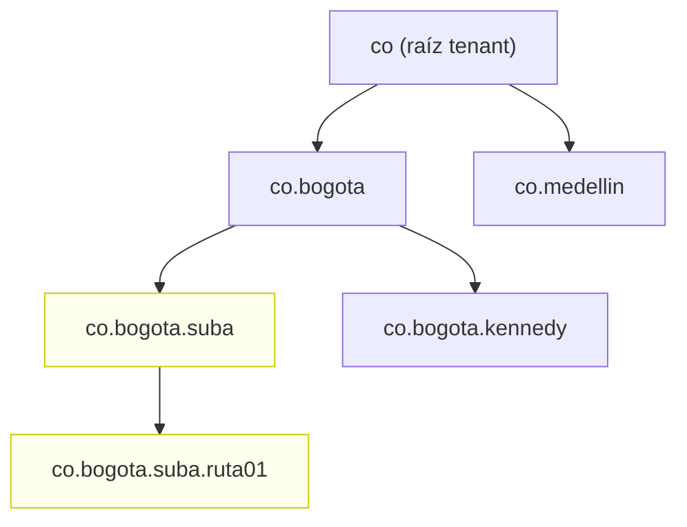

Consulta típica (subárbol de una zona del coordinador):

```sql
-- todas las zonas bajo 'co.bogota.suba' (usa el índice GiST zone_path_gist)
SELECT * FROM zone WHERE path <@ 'co.bogota.suba';
```

Esto habilita el futuro `ZoneScopeGuard`: un coordinador solo ve/actúa sobre el subárbol que tiene asignado en `zone_coordinator`.

---

## 11. Contract-first (ts-rest + zod)

`@preztiaos/contracts` es la **fuente única de verdad** del API. El mismo objeto:

- valida el `body` en la frontera del servidor (zod `.parse()`),
- tipa el cliente del móvil/web (`@ts-rest/core` `initClient`),
- documenta método, ruta, headers y respuestas.

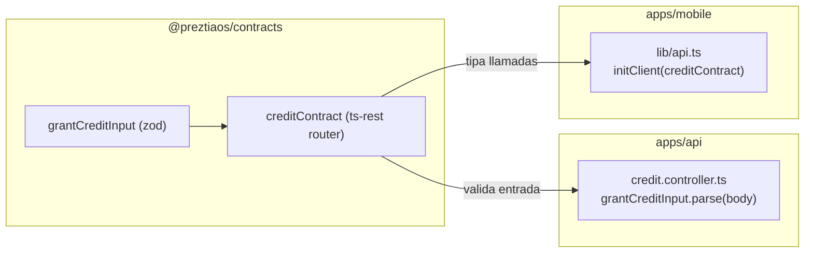

**Contrato** ([credit.ts](../packages/contracts/src/credit.ts)):

```ts
export const grantCreditInput = z.object({
  borrowerId: z.string().uuid(),
  zoneId: z.string().uuid(),
  principalMinor: z.number().int().positive(),
  interestPct: z.number().nonnegative(),
  installmentsCount: z.number().int().positive(),
});

export const creditContract = c.router({
  grantCredit: {
    method: "POST",
    path: "/credits",
    headers: z.object({ "x-tenant-id": z.string().uuid() }),
    body: grantCreditInput,
    responses: { 201: grantCreditOutput },
  },
});
```

> `tenantId` (header) y `currency` (lo fija el servidor) **no** van en `grantCreditInput`: el contrato refleja exactamente la frontera real del API.

---

## 12. Flujo de un caso de uso: otorgar crédito

End-to-end, atravesando todas las capas:

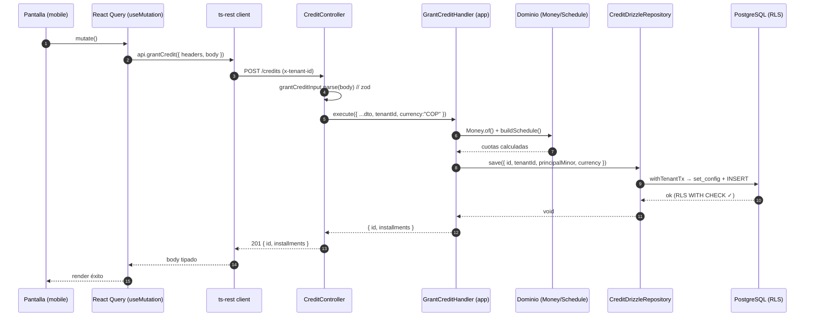

---

## 13. El dominio: dinero y calendario de cuotas

### `Money` — valor inmutable en centavos

[money.ts](../packages/domain/src/shared/money.ts) encapsula importes como **enteros** y prohíbe mezclar monedas:

```ts
Money.of(500_000, "COP")            // 5.000,00 COP
  .applyInterest(200)               // +20% (base mil: 200 = 20,0%)
  .add(otra)                        // exige misma moneda, si no → DomainError
```

### `buildSchedule` — cuotas con cuadre exacto

[schedule.ts](../packages/domain/src/credit/schedule.ts) reparte el total en `n` cuotas iguales y **ajusta el redondeo en la última**, de modo que la suma de cuotas iguala exactamente el total (sin centavos perdidos):

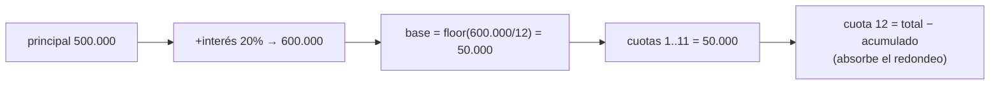

> **Invariante:** `Σ amountDueMinor === total.amountMinor`. Es la primera prueba de dominio del proyecto ([schedule.test.ts](../packages/domain/src/credit/schedule.test.ts)).

> ⚠️ **Convención de interés (base mil):** el dominio interpreta `interestPct` como *base-thousand* (`200` = 20,0%). El nombre del campo sugiere porcentaje simple; ver [Deuda técnica](#21-deuda-técnica-y-riesgos).

---

## 14. Clientes: app móvil/web (Expo)

`apps/mobile` es **una sola base de código** que corre en **iOS, Android y Web** (Expo SDK 56 + Expo Router + `react-native-web`).

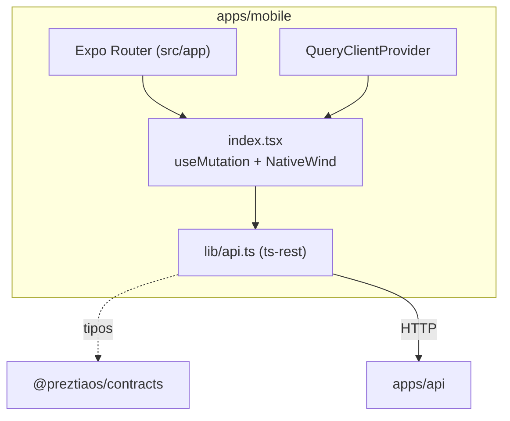

**Decisiones del cliente:**

- **Estilos:** NativeWind v4 (Tailwind para RN) → mismas clases en las tres plataformas. Tailwind v3 (lo exige NativeWind v4). `global.css` con directivas `@tailwind` + variables de fuente del template.
- **Data fetching:** TanStack React Query (`QueryClientProvider` en el layout raíz).
- **Cliente tipado:** `initClient(creditContract)`. El `baseUrl` depende de la plataforma:

| Entorno | Host de la API |
|---|---|
| Web / simulador iOS | `http://localhost:3000` |
| **Emulador Android** | `http://10.0.2.2:3000` (localhost = el emulador) |
| Dispositivo físico | IP LAN de la máquina vía `EXPO_PUBLIC_API_URL` |

- **Monorepo + Metro:** `metro.config.js` con `watchFolders` a la raíz y `nodeModulesPaths` (reemplaza al `transpilePackages` de Next). Requiere `node-linker=hoisted` (ver §16).

Arranque:

```bash
pnpm --filter @preztiaos/mobile web      # navegador
pnpm --filter @preztiaos/mobile ios      # simulador iOS
pnpm --filter @preztiaos/mobile android  # emulador Android
```

---

## 15. Infraestructura local

`docker-compose.yml` levanta los tres servicios de respaldo:

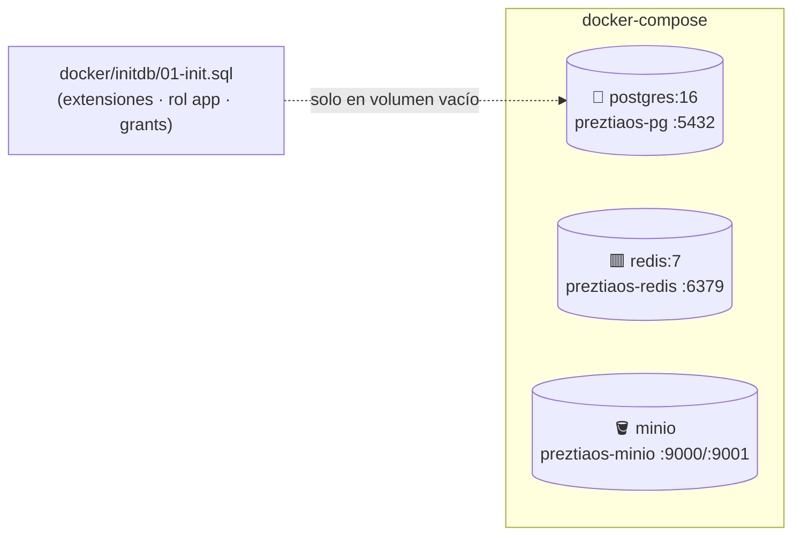

| Servicio | Imagen | Puertos | Rol |
|---|---|---|---|
| PostgreSQL | `postgres:16` | 5432 | datos + RLS + `ltree` |
| Redis | `redis:7` | 6379 | colas / cache (futuro) |
| MinIO | `minio/minio` | 9000 (API), 9001 (consola) | documentos KYC |

> ⚠️ **`01-init.sql` solo se ejecuta cuando el volumen `pgdata` está vacío.** Si cambias ese script con datos existentes, debes recrear el volumen (`docker compose down -v`) o aplicarlo a mano con `psql`.

Comandos:

```bash
pnpm db:up        # docker compose up -d
pnpm db:migrate   # drizzle-kit migrate (carga .env de la raíz vía dotenv)
pnpm db:down      # docker compose down
```

---

## 16. Build, tooling y pipeline

- **Gestor:** pnpm 9 (workspaces). **Node ≥ 20** (.nvmrc / engines).
- **Orquestador:** Turborepo ([turbo.json](../turbo.json)).
- **`node-linker=hoisted`** (`.npmrc`): **obligatorio** porque Metro/Expo no resuelve bien los symlinks aislados de pnpm. Al cambiarlo hay que borrar **todos** los `node_modules` (incluidos los anidados) y reinstalar, o quedan bins rotos.

### Grafo de tareas (Turborepo)

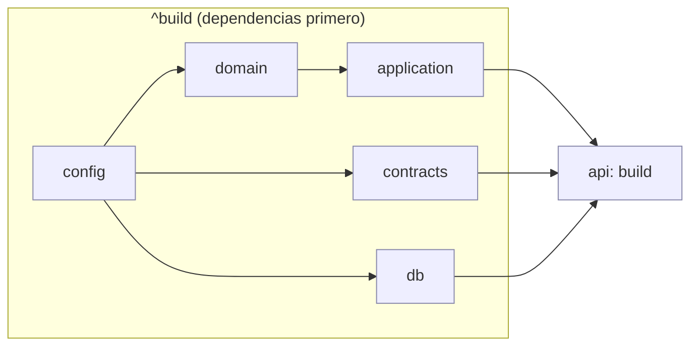

`turbo.json` declara `build.dependsOn: ["^build"]` → los paquetes se compilan **en orden topológico** y las salidas (`dist/`) se cachean. La API consume `dist/` de los paquetes, por eso **`pnpm build` debe correr antes** de que `apps/api` resuelva los `@preztiaos/*`.

> Las apps (`mobile`) **no** tienen script `build` en el pipeline: Metro empaqueta en tiempo de arranque.

```bash
pnpm build       # turbo run build (cacheado, topológico)
pnpm dev         # api + web + watchers en paralelo
pnpm typecheck
pnpm test
```

---

## 17. Integración continua (CI)

Pipeline propuesto (GitHub Actions) con Postgres efímero como *service*:

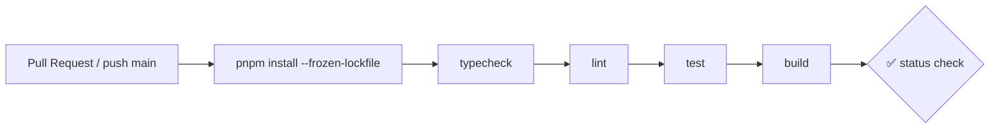

Pasos: `install → typecheck → lint → test → build`, con `DATABASE_URL`/`APP_DATABASE_URL` apuntando al servicio Postgres del runner.

**Protección de rama `main`:** requerir PR, requerir status checks, sin force-push.

> 🔜 Añadir como check obligatorio las **pruebas de aislamiento de tenant** (Testcontainers) — es la red de seguridad de RLS.

---

## 18. Convenciones del proyecto

| Tema | Convención |
|---|---|
| **Scope de paquetes** | `@preztiaos/*` (con “os”). Erratas que han roto el workspace: `prestiaos`, `@preztia`, `cobranza(os)`. |
| **Dinero** | siempre **unidades menores** (centavos) como entero (`*_minor`, `bigint`/`number int`). |
| **Identificadores** | `uuid` con `gen_random_uuid()` / `randomUUID()`. |
| **Multitenancy** | toda tabla de negocio lleva `tenant_id`; toda escritura va por `withTenantTx`. |
| **Validación** | en la frontera HTTP con zod del contrato; el dominio asume datos válidos. |
| **Fechas** | `timestamptz` para auditoría; `date` para fechas de negocio (inicio/fin). |
| **Imports de Node** | explícitos (`node:crypto`), con `@types/node` en el paquete. |
| **Idioma** | dominio y comentarios en español; identificadores de código en inglés. |

---

## 19. Bounded contexts y roadmap

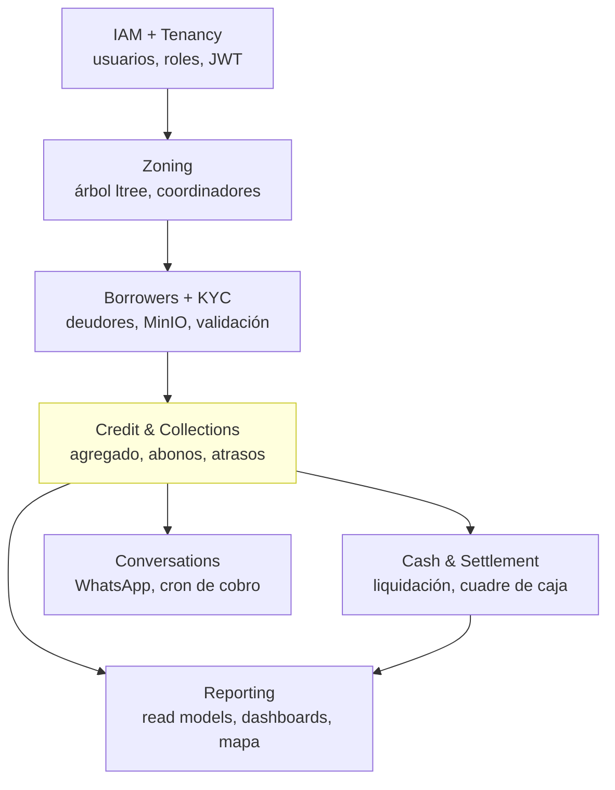

**Orden de implementación sugerido** (cada uno arranca con spec Gherkin → prueba de dominio → implementación):

1. **IAM + Tenancy completos** — usuarios, roles, login JWT, config de tenant.
2. **Zoning** — CRUD del árbol con `ltree`, asignación de coordinadores, `ZoneScopeGuard`.
3. **Borrowers + KYC** — deudores, carga a MinIO, máquina de estados de validación.
4. **Credit & Collections** — agregado completo, abonos, atrasos, recargos. *(esqueleto actual)*
5. **Cash & Settlement** — liquidación diaria y cuadre de caja.
6. **Conversations (WhatsApp)** — webhook idempotente, máquina de estados, cron de cobro.
7. **Reporting** — read models (CQRS) para dashboards y mapa.

**Leyenda de estado actual:** solo el *slice* de **Credit** existe como esqueleto vertical (contrato → controlador → caso de uso → dominio → repo → RLS), suficiente para validar la arquitectura de punta a punta.

---

## 20. Registro de decisiones (ADR)

Resumen de decisiones tomadas. Cada una puede expandirse a un ADR propio en `docs/adr/` cuando se necesite.

| # | Decisión | Motivo | Estado |
|---|---|---|---|
| 1 | **Monorepo pnpm + Turborepo** | compartir contratos/dominio, builds cacheados | ✅ |
| 2 | **Aislamiento de tenant con RLS `FORCE` + rol `app`** | seguridad que no depende del código de aplicación | ✅ |
| 3 | **Contract-first con ts-rest + zod** | un solo lugar para tipos y validación API↔clientes | ✅ |
| 4 | **Dominio puro (hexagonal)** | testeabilidad, independencia de framework | ✅ |
| 5 | **`ltree` para zonificación** | consultas de subárbol eficientes (GiST) | ✅ |
| 6 | **Dinero en unidades menores (entero)** | evitar errores de coma flotante | ✅ |
| 7 | **Cliente único Expo (iOS/Android/Web)** | máximo reuso; el “cerebro” tipado es agnóstico de plataforma | ✅ |
| 8 | **NativeWind v4 + Tailwind v3** | mismas clases de estilo en las tres plataformas | ✅ |
| 9 | **`node-linker=hoisted`** | requisito de Metro/Expo para resolver el workspace | ✅ |
| 10 | **Drizzle ORM + drizzle-kit** | schema tipado + migraciones; `customType` para `ltree` | ✅ |
| 11 | **Identidad del tenant vía header (esqueleto)** | simplicidad inicial; migrará a JWT/subdominio | 🔄 provisional |
| 12 | **Atributos de calidad como criterio de aceptación** ([§3](#3-atributos-de-calidad-y-estándares-de-código)) | SRP + código limpio/entendible/mantenible y corrección verificable obligatorios en todo algoritmo futuro | ✅ |
| 13 | **Pipeline antifraude documental en 4 etapas** (ver [analisisPlataformas.md](analisisPlataformas.md)): extracción persistida (`document_extraction.file_metadata`) → reglas locales puras (`domain/antifraud`) → APIs libres (Minha Receita, BrasilAPI CEP/DDD) → Serpro opcional; se dispara al completar los documentos y persiste el reporte append-only en `document_validation` | la IA solo extrae/cruza (AIForge-Doc); la autenticidad la da la fuente emisora; fuentes externas caídas degradan a alerta BAJA sin bloquear | ✅ |

---

## 21. Deuda técnica y riesgos

> 🔴 = **crítico**: bloqueante para producción por tocar dinero o aislamiento de tenants (ver [§3.7](#37-atributos-de-calidad-del-sistema--ilities)).

| Ítem | Detalle | Acción sugerida |
|---|---|---|
| **Placeholders en el repo de crédito** | [credit.repository.ts](../apps/api/src/credit/credit.repository.ts) usa `borrowerId = zoneId = id` y valores fijos (`interestPct: 200`, fechas hardcodeadas) | propagar el `GrantCreditCommand` completo hasta el insert |
| 🔴 **Identidad de tenant por header** (seguridad, [§3.7](#37-atributos-de-calidad-del-sistema--ilities)) | `x-tenant-id` es spoofable; el middleware no rechaza si falta. Riesgo de cruce de datos entre tenants | derivar el `tenantId` del **JWT** verificado (no del header del cliente); `tenantMiddleware` responde **401** si no hay tenant válido; mantener el header solo para entornos de prueba detrás de un flag |
| 🔴 **Idempotencia ausente en dinero y webhooks** (confiabilidad, [§3.7](#37-atributos-de-calidad-del-sistema--ilities)) | reintentos de cliente, reenvíos de WhatsApp o reintentos de cola pueden **duplicar abonos/cobros**; hoy nada lo impide | exigir `Idempotency-Key` en endpoints de dinero y persistir resultado por clave (tabla `idempotency_key` o Redis con TTL); para WhatsApp, *dedup* por `message_id` del proveedor; los webhooks deben ser seguros ante reentrega |
| 🔴 **Audit log inexistente** (auditabilidad, [§3.7](#37-atributos-de-calidad-del-sistema--ilities)) | no hay traza inmutable de quién hizo qué movimiento de dinero / cambio de estado; obligatorio en fintech | tabla `audit_log` **append-only** (`tenant_id`, actor, acción, entidad, antes/después, `correlation_id`, `ts`); escribir dentro de la misma transacción del cambio (`withTenantTx`); sin `UPDATE`/`DELETE` (revocar el permiso al rol `app`) |
| **Semántica de `interestPct`** | el dominio lo trata como *base-mil* (200=20%), el nombre sugiere % simple | renombrar a `interestBaseThousand` o normalizar en la frontera |
| **`tx: any` en `withTenantTx`** | se pierde el tipado de Drizzle dentro de la transacción | tipar con el tipo de transacción de Drizzle |
| **RLS por tabla manual** | cada tabla nueva debe repetir el bloque `ENABLE/FORCE/POLICY` | helper SQL o generador para no olvidarlo |
| **Pruebas de aislamiento ausentes** | no hay test automatizado que verifique RLS | Testcontainers como status check obligatorio |
| **Nombre raíz del workspace** | el `name` raíz fue `prestiaos`; ya corregido a `preztiaos` | vigilar erratas de scope en nuevos paquetes |

---

## 22. Glosario

| Término | Definición |
|---|---|
| **Tenant** | empresa/operador aislado dentro de la misma instancia. |
| **RLS** | Row-Level Security: filtrado de filas a nivel de PostgreSQL por política. |
| **`FORCE ROW LEVEL SECURITY`** | aplica RLS incluso al dueño de la tabla. |
| **Puerto / Adaptador** | interfaz que define una necesidad (puerto) y su implementación concreta (adaptador). |
| **Contrato** | definición ts-rest+zod de un endpoint: método, ruta, headers, body, respuestas. |
| **Unidad menor (minor unit)** | el importe en su subdivisión entera (centavos). |
| **`ltree`** | tipo de PostgreSQL para rutas jerárquicas (árbol de zonas). |
| **Read model** | proyección optimizada para lectura (CQRS), para dashboards/reportes. |
| **Slice vertical** | funcionalidad que atraviesa todas las capas de punta a punta. |

---

> **Cómo mantener este documento:** ante cada decisión relevante, añade una fila en [§20 ADR](#20-registro-de-decisiones-adr), actualiza el diagrama afectado y, si cambia el alcance, ajusta [§19 roadmap](#19-bounded-contexts-y-roadmap). Mantén la fecha de “última actualización” del encabezado.
