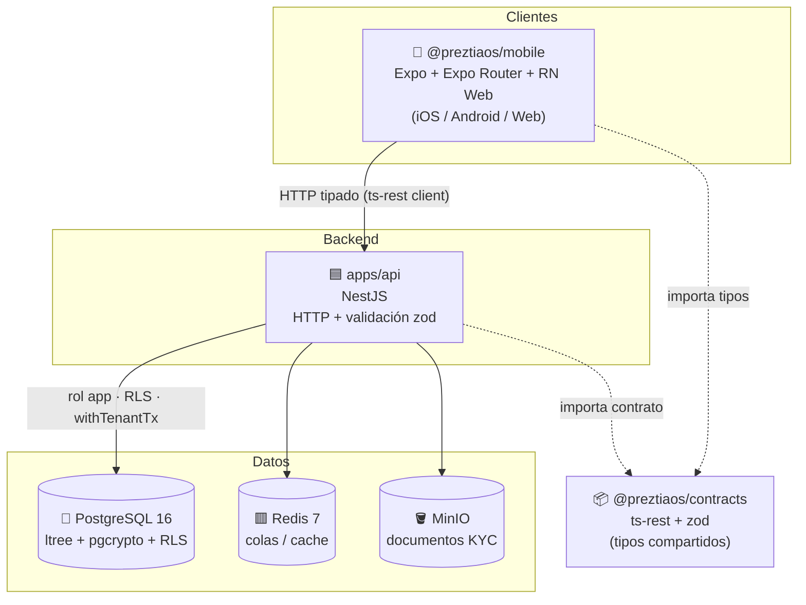
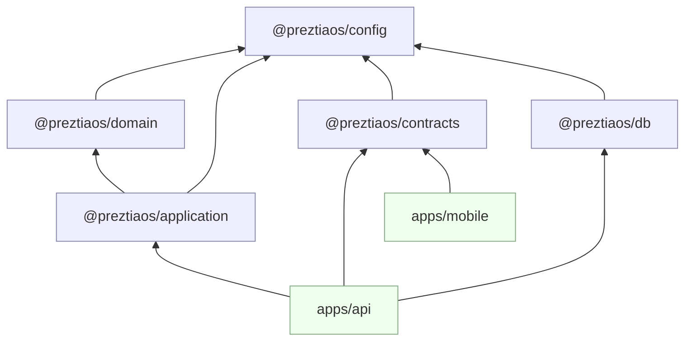
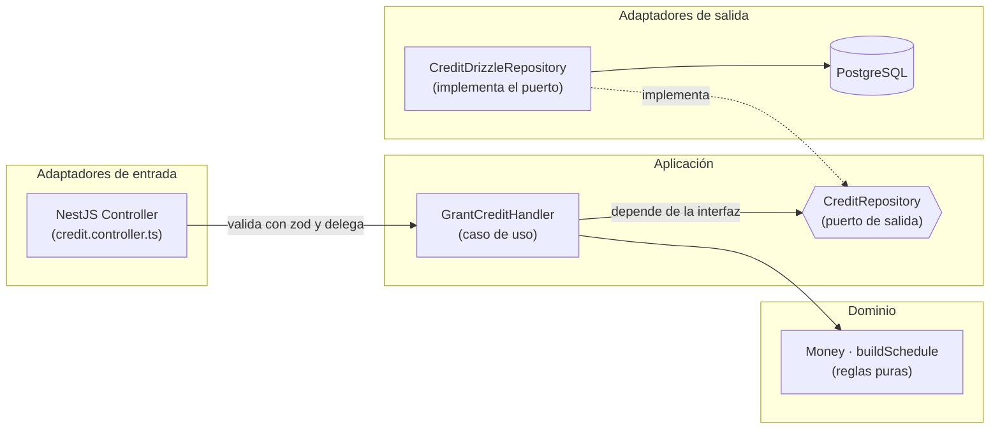
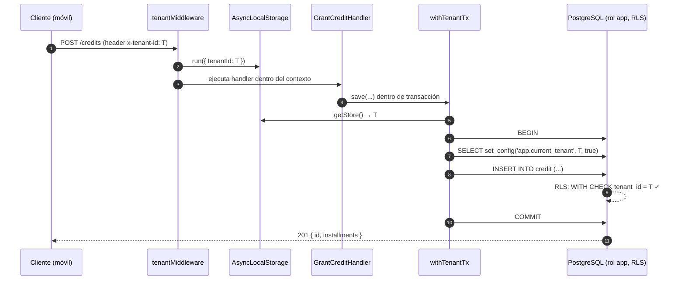
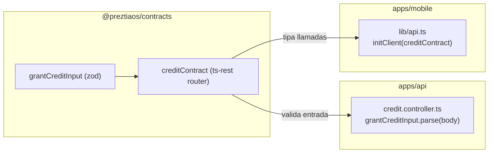
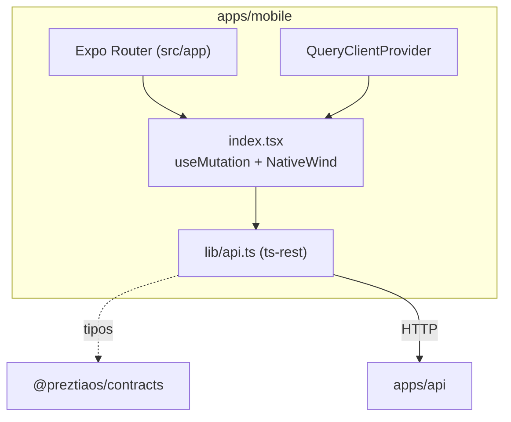
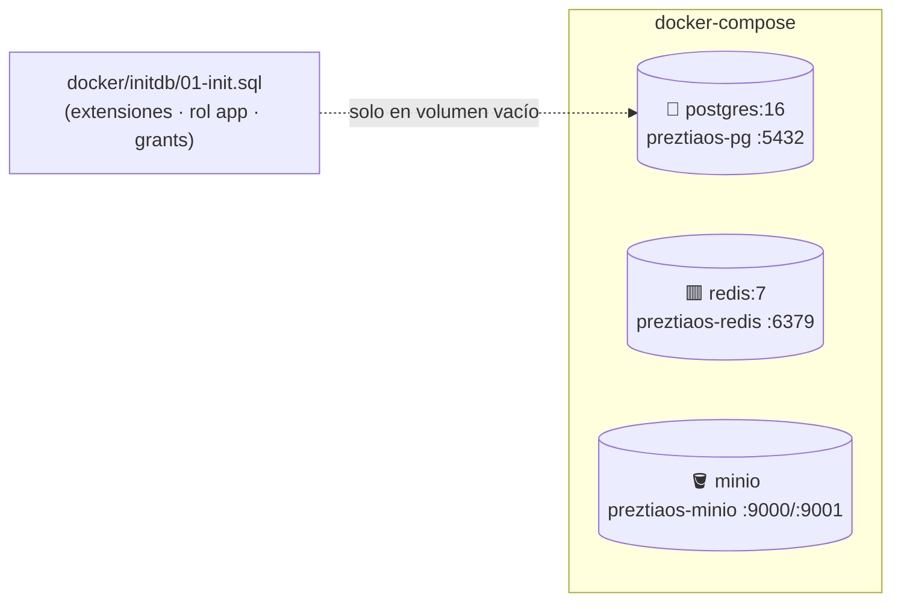
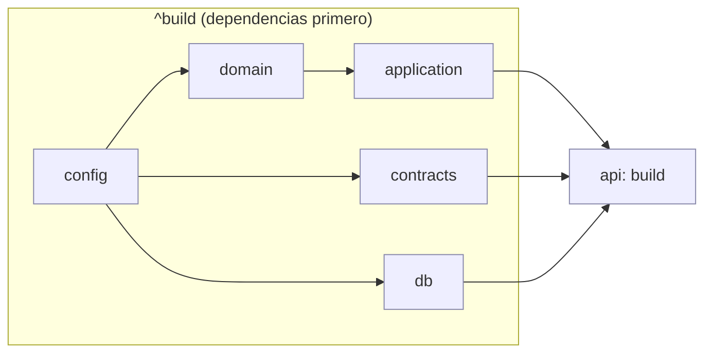
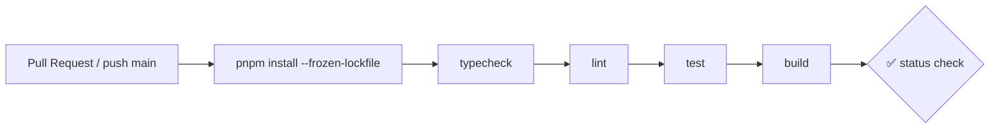

# PreztiaOS — Documento de Arquitectura

> **Estado:** documento vivo. Se ajusta conforme se toman decisiones.
> **Última actualización:** 2026-06-14 (IAM por roles + plano de control del super admin: ADR #20–#21; tabla de conexiones §8 con rol `platform`; §3.7 Seguridad y §21 refrescadas).
> **Ámbito:** plataforma multi-tenant de **préstamos y cobranza** (microcrédito de ruta/gota a gota, cobranza por zonas).
>
> 📚 **Conjunto de documentos:** este archivo cubre **arquitectura** (el *cómo*). El **análisis y diseño funcional** (el *qué*, validado contra el código) está en **[DESIGN.md](DESIGN.md)**; el cliente, en **[FRONTEND_ARCHITECTURE.md](FRONTEND_ARCHITECTURE.md)**; el antifraude documental a fondo, en **[analisisPlataformas.md](analisisPlataformas.md)**.

---

## Tabla de contenido

1. [Visión del producto](#1-visión-del-producto)
2. [Principios de arquitectura](#2-principios-de-arquitectura)
3. [Atributos de calidad y estándares de código](#3-atributos-de-calidad-y-estándares-de-código)
4. [Vista de contexto (C4 nivel 1)](#4-vista-de-contexto-c4-nivel-1)
5. [Vista de contenedores (C4 nivel 2)](#5-vista-de-contenedores-c4-nivel-2)
6. [Estructura del monorepo](#6-estructura-del-monorepo)
7. [Arquitectura en capas (hexagonal / DDD)](#7-arquitectura-en-capas-hexagonal--ddd)
8. [Multitenancy y seguridad (RLS)](#8-multitenancy-y-seguridad-rls)
9. [Modelo de datos](#9-modelo-de-datos) — *ver [DESIGN.md](DESIGN.md)*
10. [Zonificación con `ltree`](#10-zonificación-con-ltree) — *ver [DESIGN.md](DESIGN.md)*
11. [Contract-first (ts-rest + zod)](#11-contract-first-ts-rest--zod)
12. [Flujo de un caso de uso: otorgar crédito](#12-flujo-de-un-caso-de-uso-otorgar-crédito) — *ver [DESIGN.md](DESIGN.md)*
13. [El dominio: dinero y calendario de cuotas](#13-el-dominio-dinero-y-calendario-de-cuotas) — *ver [DESIGN.md](DESIGN.md)*
14. [Clientes: app móvil/web (Expo)](#14-clientes-app-móvilweb-expo)
15. [Infraestructura local](#15-infraestructura-local)
16. [Build, tooling y pipeline](#16-build-tooling-y-pipeline)
17. [Integración continua (CI)](#17-integración-continua-ci)
18. [Convenciones del proyecto](#18-convenciones-del-proyecto)
19. [Bounded contexts y roadmap](#19-bounded-contexts-y-roadmap) — *ver [DESIGN.md](DESIGN.md)*
20. [Registro de decisiones (ADR)](#20-registro-de-decisiones-adr)
21. [Deuda técnica y riesgos](#21-deuda-técnica-y-riesgos)
22. [Glosario](#22-glosario)

---

## 1. Visión del producto

PreztiaOS es un sistema **multi-tenant** (varias empresas/operadores aislados en una sola instancia) para gestionar:

- **Préstamos** de bajo monto con cuotas frecuentes (diario, semanal, quincenal, mensual).
- **Cobranza por zonas geográficas/jerárquicas**, con coordinadores y cobradores asignados a un subárbol de zonas.
- **Conciliación de caja** diaria y liquidación.
- **Conversaciones automatizadas** (WhatsApp) para recordatorios y gestión de cobro.
- **Reportería** (dashboards, mapas) sobre modelos de lectura.

El núcleo del diseño se apoya en tres pilares:

| Pilar | Cómo se materializa |
|---|---|
| **Aislamiento fuerte entre tenants** | Row-Level Security (RLS) en PostgreSQL + rol de aplicación sin privilegios de bypass. |
| **Tipado de punta a punta** | Un único paquete de contratos (`ts-rest` + `zod`) compartido por API y clientes. |
| **Dominio rico y testeable** | Lógica de negocio (dinero, calendario de cuotas) en paquetes puros, sin framework ni I/O. |

---

## 2. Principios de arquitectura

1. **Arquitectura hexagonal (puertos y adaptadores).** El dominio y los casos de uso no conocen NestJS, Drizzle ni HTTP. La infraestructura implementa interfaces (*puertos*) definidas por la capa de aplicación.
2. **Domain-Driven Design.** Cada funcionalidad arranca con su **spec** (Gherkin) → prueba de dominio → implementación. Bounded contexts explícitos (IAM, Zoning, Borrowers, Credit, Cash, Conversations, Reporting).
3. **Contract-first.** El contrato HTTP es la fuente única de verdad; tanto el servidor (NestJS) como los clientes (web/móvil) derivan sus tipos del mismo paquete.
4. **Seguridad por defecto / defense-in-depth.** El aislamiento de tenant no depende de que el código “recuerde” filtrar: lo garantiza la base de datos vía RLS `FORCE`.
5. **Dinero como enteros.** Todo importe se maneja en **unidades menores** (centavos) para evitar errores de coma flotante.
6. **Monorepo con límites claros.** `packages/*` reutilizables y agnósticos; `apps/*` componen e integran.
7. **CQRS-ready.** La escritura va por agregados de dominio; la lectura (reporting) usará *read models* dedicados más adelante.

---

## 3. Atributos de calidad y estándares de código

> **Regla vinculante.** Esta sección define los **atributos de calidad** que rigen *todo* el código del proyecto. **Todo algoritmo, caso de uso o módulo futuro debe cumplirla** y demostrar que es **correcto** (ver §3.6). No son recomendaciones: son **criterios de aceptación** de cualquier PR y parte obligatoria de la revisión de código.

Los cuatro atributos que perseguimos, en orden de aplicación al escribir código:

| Atributo | Qué significa aquí | Cómo se verifica |
|---|---|---|
| **Responsabilidad única (SRP)** | cada unidad tiene una sola razón para cambiar | revisión + límites de capa (§7) |
| **Código limpio** | sin duplicación, sin números mágicos, errores explícitos | lint + revisión |
| **Código entendible** | se lee como prosa; intención evidente sin comentarios de relleno | revisión de pares |
| **Código mantenible** | cambiar/extender es barato y de bajo riesgo | pruebas + acoplamiento bajo |

### 3.1 Principio de responsabilidad única (SRP)

Cada módulo, clase o función tiene **una sola razón para cambiar**. En este proyecto se traduce en una asignación estricta de responsabilidades por capa:

| Pieza | **Sí** hace | **No** hace |
|---|---|---|
| **Controller** (`*.controller.ts`) | valida la frontera HTTP (zod) y delega | reglas de negocio, SQL |
| **Caso de uso** (`*Handler`) | orquesta dominio + puertos, define la transacción | validar HTTP, armar SQL, calcular reglas |
| **Dominio** (`Money`, `buildSchedule`) | reglas puras e invariantes | I/O, conocer NestJS/Drizzle/HTTP |
| **Repositorio** (`*Repository`) | traduce dominio ↔ persistencia | reglas de negocio |
| **Contrato** (`@preztiaos/contracts`) | forma y validación del API | lógica de dominio o infra |

> 🚨 **Señales de violación del SRP:** nombres con “y”/`Manager`/`Util` genéricos; funciones de más de ~40 líneas o con varios niveles de abstracción mezclados; una clase que importa de capas distintas (p. ej. dominio que importa Drizzle); un `if` que decide *qué* hacer y *cómo* hacerlo a la vez.

### 3.2 Código limpio (clean code)

- **Nombres reveladores de intención.** El nombre dice *qué* y *por qué*, no *cómo*. Identificadores en inglés, dominio/comentarios en español (§18).
- **Funciones pequeñas y de un solo nivel de abstracción.** Una función hace una cosa; si necesita un comentario para separar “bloques”, son funciones distintas.
- **Sin números mágicos.** Constantes con nombre (p. ej. la base-mil del interés, no `200` suelto).
- **Sin duplicación (DRY).** La lógica vive en un solo lugar; el reuso pasa por `packages/*`.
- **Errores explícitos.** Lanzar `DomainError` con mensaje claro; **prohibido** `catch` vacío o tragarse errores. La validación de entrada ocurre en la frontera (zod); el dominio asume datos válidos.
- **Inmutabilidad por defecto.** Los objetos de valor son inmutables (`Money` devuelve nuevas instancias; nunca muta).
- **Sin código muerto ni `console.log` de depuración** en lo que se mergea.

### 3.3 Código entendible (legibilidad)

- El código se lee de arriba abajo como una narración del caso de uso.
- **Comentarios que explican el porqué**, no el qué (el qué lo dice el código). Documentar invariantes y decisiones no obvias (p. ej. “la última cuota absorbe el redondeo”).
- Una sola forma de hacer cada cosa (consistencia con las convenciones de §18).
- Tipos explícitos en las fronteras públicas; evitar `any` (ver deuda `tx: any` en §21).
- Estructura predecible: un *slice* nuevo replica la estructura del *slice* de crédito (contrato → controlador → caso de uso → dominio → repo).

### 3.4 Código fácil de mantener (mantenibilidad)

- **Bajo acoplamiento / alta cohesión:** se logra con la inversión de dependencias (§7); el dominio y la aplicación no dependen de framework ni de infraestructura.
- **Dependencias solo “hacia abajo”** (regla de oro, §6): apps → packages, application → domain.
- **Pruebas como red de seguridad:** todo cambio de comportamiento se cubre con prueba (dominio puro primero); el invariante de negocio se vuelve test (p. ej. `Σ cuotas === total`).
- **Cambios localizados:** añadir una regla no debe obligar a tocar varias capas; si lo hace, revisar el diseño.
- **Configuración fuera del código:** secretos y entornos por variables (`.env`), nunca hardcodeados (ver placeholders en §21).

### 3.5 Checklist obligatorio para cada nuevo algoritmo / caso de uso

Antes de marcar como “listo”, todo algoritmo o caso de uso nuevo debe poder responder **sí** a:

- [ ] Arrancó por su **spec (Gherkin) → prueba de dominio → implementación** (DDD, §2).
- [ ] Cada pieza respeta el **SRP** (tabla §3.1); no cruza límites de capa.
- [ ] Las **reglas de negocio están en el dominio puro**, sin I/O ni framework.
- [ ] La **entrada se valida en la frontera** (zod del contrato); el dominio asume datos válidos.
- [ ] Los **invariantes** están enunciados y cubiertos por **pruebas** (ver §3.6).
- [ ] **Dinero en unidades menores** (entero), sin coma flotante (§2, principio 5).
- [ ] Respeta **multitenancy**: toda escritura va por `withTenantTx`; toda tabla lleva `tenant_id`.
- [ ] Sin **números mágicos**, sin **duplicación**, errores **explícitos**, nombres **reveladores**.
- [ ] Pasa **typecheck + lint + test + build** (§17) en verde.

### 3.6 Definición de “correcto” (corrección verificable)

Un algoritmo es **correcto** solo si su corrección es **demostrable y verificada**, no asumida:

1. **Invariantes explícitos.** Se enuncian las propiedades que siempre deben cumplirse (ej.: `Σ amountDueMinor === total.amountMinor`).
2. **Pruebas que los verifican.** Cada invariante y cada caso borde (cero, redondeo, monedas distintas, valores límite) tiene una prueba automatizada.
3. **Determinismo y manejo de bordes.** Entradas inválidas fallan rápido con `DomainError`; no hay estados silenciosamente incorrectos.
4. **Verde en CI.** La corrección se considera establecida solo cuando las pruebas pasan en el pipeline (§17), no en la máquina local.

> En resumen: **no se mezcla responsabilidades, se escribe limpio y legible, se diseña para el cambio, y se prueba la corrección.** Cualquier código que no cumpla estos cuatro atributos se considera incompleto.

### 3.7 Atributos de calidad del sistema (-ilities)

Los §3.1–§3.6 son atributos a **nivel de código**. Esta sección añade los atributos a **nivel de sistema** que, por tratarse de una plataforma **fintech multi-tenant** (dinero, deudores, multiusuario), son tan obligatorios como los anteriores. Cada algoritmo o caso de uso futuro debe considerarlos y dejar explícita su estrategia.

#### Críticos (dinero + multi-tenant)

| Atributo | Qué exigimos (reglas accionables) | Estado / referencia |
|---|---|---|
| **Seguridad** | aislamiento por RLS `FORCE` + rol `app`; identidad del tenant desde **JWT** (no header spoofable), 401 si falta; authZ por rol y por subárbol de zonas (`ZoneScopeGuard`); secretos solo por entorno; validación en la frontera (zod) | ✅ RLS; ✅ authN (login JWT) y **authZ por rol** (`requireRole`/`SuperAdminGuard`, 403) + alcance por zonas (`zone-scope`); ✅ `JwtGuard` liga `x-tenant-id` al claim (ADR #20–#21) |
| **Auditabilidad / trazabilidad** | **todo movimiento de dinero y cambio de estado** se registra en un **audit log append-only** (quién, qué, cuándo, tenant); `correlationId` por petición; nada de borrar/editar historial financiero | ❌ por diseñar |
| **Confiabilidad / idempotencia** | toda operación de dinero y todo webhook (WhatsApp) es **idempotente** (clave de idempotencia / `dedup`); reintentos seguros; consistencia transaccional (`withTenantTx`); sin doble cobro/abono | ⚠️ transacciones ✅; webhooks/PIX idempotentes ✅; `Idempotency-Key` HTTP pendiente (§21) |
| **Integridad / corrección financiera** | invariantes de agregado (saldo nunca negativo, `Σ abonos ≤ total`, cuadre de caja); dinero en enteros (`Money`); invariantes verificados con pruebas (§3.6) | ⚠️ `Money` + cuadre de cuotas ✅; invariantes de agregado/caja pendientes |

#### Operación

| Atributo | Qué exigimos (reglas accionables) | Estado / referencia |
|---|---|---|
| **Observabilidad** | logs **estructurados** (JSON) con `tenantId` + `correlationId`; métricas de negocio y técnicas; *tracing* de extremo a extremo; sin PII en logs | ❌ por diseñar |
| **Disponibilidad / resiliencia** | timeouts y **reintentos con backoff** hacia servicios externos (WhatsApp, mapas); *circuit breaker*; degradación elegante; colas (Redis) para desacoplar picos | ⚠️ Redis previsto; políticas pendientes |
| **Rendimiento / escalabilidad** | índices adecuados (GiST en `ltree` ✅); **paginación obligatoria** en listados; evitar N+1; trabajo pesado (cobro masivo, notificaciones) a colas; *read models* (CQRS) para reportería | ⚠️ parcial (§9, §2 CQRS-ready) |
| **Privacidad / cumplimiento** | datos personales de deudores y KYC: **cifrado en reposo** (MinIO), control de acceso, política de retención y minimización; no exponer PII en API/logs | ❌ por diseñar |

> Estos atributos se conectan con la [§21 Deuda técnica](#21-deuda-técnica-y-riesgos): varios (validación de tenant, pruebas de aislamiento) ya están listados como pendientes y son la materialización de estas exigencias.

---

## 4. Vista de contexto (C4 nivel 1)


---

## 5. Vista de contenedores (C4 nivel 2)



> **Nota:** la API y la web usan por defecto el puerto **3000**. Para correr ambas en local, cambia el puerto de la web (`-- -p 3001`) o el de la API (`PORT=3001`).

---

## 6. Estructura del monorepo

Gestionado con **pnpm workspaces** + **Turborepo**. Scope canónico de los paquetes: **`@preztiaos`**.

```
preztia/
├─ apps/
│  ├─ api/                 # NestJS (HTTP, middleware de tenant, repos Drizzle)
│  └─ mobile/              # Expo (iOS/Android/Web) — Expo Router + NativeWind
├─ packages/
│  ├─ config/             # @preztiaos/config — tsconfig.base.json, eslint.base.cjs
│  ├─ domain/             # @preztiaos/domain — lógica pura (Money, buildSchedule)
│  ├─ application/        # @preztiaos/application — casos de uso + puertos
│  ├─ contracts/          # @preztiaos/contracts — ts-rest + zod (fuente de tipos)
│  └─ db/                 # @preztiaos/db — Drizzle schema, migraciones, createDb
├─ docker/initdb/          # 01-init.sql (extensiones, rol app, grants)
├─ docs/                   # 📄 este documento
├─ docker-compose.yml      # pg + redis + minio
├─ turbo.json              # pipeline de tareas
├─ pnpm-workspace.yaml
└─ .npmrc                  # node-linker=hoisted (requerido por Metro/Expo)
```

### Grafo de dependencias entre paquetes



**Regla de oro de dependencias:** las flechas solo apuntan “hacia abajo” (apps → packages, application → domain). El dominio no depende de nadie de negocio salvo `config`.

---

## 7. Arquitectura en capas (hexagonal / DDD)



| Capa | Paquete | Conoce a… | NO conoce a… |
|---|---|---|---|
| **Dominio** | `@preztiaos/domain` | nada externo | aplicación, infra, HTTP |
| **Aplicación** | `@preztiaos/application` | dominio + sus propios puertos | NestJS, Drizzle, HTTP |
| **Contratos** | `@preztiaos/contracts` | zod | dominio/infra |
| **Infraestructura** | `apps/api/*`, `@preztiaos/db` | aplicación, contratos, Drizzle | — |
| **Presentación** | `apps/mobile` | contratos | dominio, db |

**Inversión de dependencias en acción** ([grant-credit.ts](../packages/application/src/credit/grant-credit.ts)):

```ts
// La aplicación DECLARA lo que necesita (puerto), no cómo se hace.
export interface CreditRepository {
  save(credit: { id: string; tenantId: string; principalMinor: number; currency: string }): Promise<void>;
}

export class GrantCreditHandler {
  constructor(private readonly credits: CreditRepository) {} // recibe la implementación
  async execute(cmd: GrantCreditCommand) { /* usa dominio + puerto */ }
}
```

La infraestructura ([credit.repository.ts](../apps/api/src/credit/credit.repository.ts)) implementa ese puerto con Drizzle, sin que el dominio se entere.

---

## 8. Multitenancy y seguridad (RLS)

El aislamiento entre tenants es la **propiedad de seguridad más importante** del sistema y se garantiza en **tres niveles**:

1. **Identificación del tenant** — middleware que lo extrae (hoy de un header `x-tenant-id`; en producción del JWT/subdominio) y lo guarda en un `AsyncLocalStorage`.
2. **Propagación por transacción** — cada operación se ejecuta dentro de `withTenantTx`, que fija `app.current_tenant` con `set_config(..., true)` (alcance de transacción).
3. **Aplicación en la base de datos** — políticas RLS con `FORCE ROW LEVEL SECURITY` que filtran por `tenant_id = current_setting('app.current_tenant')`. La app se conecta con el rol **`app`** (`NOSUPERUSER NOBYPASSRLS`), así que **no puede** saltarse el filtro aunque el código tenga un bug.



**Política RLS aplicada** (de [0001_rls_and_ltree.sql](../packages/db/migrations/0001_rls_and_ltree.sql)), repetida por cada tabla con `tenant_id`:

```sql
ALTER TABLE credit ENABLE ROW LEVEL SECURITY;
ALTER TABLE credit FORCE  ROW LEVEL SECURITY;   -- aplica incluso al dueño de la tabla
CREATE POLICY tenant_isolation ON credit
  USING      (tenant_id = current_setting('app.current_tenant')::uuid)
  WITH CHECK (tenant_id = current_setting('app.current_tenant')::uuid);
```

**Separación de roles de conexión:**

| Variable | Rol | Uso |
|---|---|---|
| `DATABASE_URL` | `preztia` (dueño del esquema, superusuario) | **migraciones** (DDL) |
| `APP_DATABASE_URL` | `app` (`NOBYPASSRLS`) | **runtime del plano de datos** (todos los tenants) |
| `PLATFORM_DATABASE_URL` | `platform` (`BYPASSRLS`) | **plano de control del super admin** (CRUD de tenants + provisión de admins), SOLO tras el `SuperAdminGuard` |

> ⚠️ Si la app se conecta por error con el rol dueño, RLS `FORCE` igual aplica, pero la regla operativa es: **el plano de datos siempre con `app`**.

> 🛂 **Plano de control (super admin).** El `SUPER_ADMIN` no tiene `tenant_id` y opera *cruzando* tenants. Para no relajar RLS en el plano de datos, su CRUD de la tabla **global `tenant`** y la provisión de admins van por una conexión dedicada (`platform`, `BYPASSRLS`), alcanzable **solo** por los endpoints con `SuperAdminGuard` (`apps/api/platform/*`, `withPlatformTx`). Todo lo demás (usuarios, zonas, cobradores, clientes) sigue por el rol `app` + RLS + `JwtGuard` (ADR #21).

> 🔒 **Red de seguridad pendiente (CI):** pruebas de aislamiento con Testcontainers como *status check* obligatorio — insertar con tenant A y verificar que una consulta con `app.current_tenant = B` no lo ve.

---

## 9. Modelo de datos

> El **modelo de datos completo** (las ~18 tablas, 12 enums, invariantes y relaciones) vive ahora en **[DESIGN.md §5](DESIGN.md#5-modelo-de-datos)**. Regla **arquitectónica** que se mantiene aquí: toda tabla de negocio lleva `tenant_id` y queda protegida por RLS `FORCE` (§8); el dinero se guarda en unidades menores enteras (`*_minor`).

---

## 10. Zonificación con `ltree`

> El diseño de la jerarquía de zonas (árbol `ltree`, consultas de subárbol, `ZoneScopeGuard`) se documenta en **[DESIGN.md](DESIGN.md#3-mapa-de-bounded-contexts-y-estado-de-implementación)**. Decisión arquitectónica asociada: **ADR #5** (`ltree` + índice GiST para subárbol eficiente).

---

## 11. Contract-first (ts-rest + zod)

`@preztiaos/contracts` es la **fuente única de verdad** del API. El mismo objeto:

- valida el `body` en la frontera del servidor (zod `.parse()`),
- tipa el cliente del móvil/web (`@ts-rest/core` `initClient`),
- documenta método, ruta, headers y respuestas.



**Contrato** ([credit.ts](../packages/contracts/src/credit.ts)):

```ts
export const grantCreditInput = z.object({
  borrowerId: z.string().uuid(),
  zoneId: z.string().uuid(),
  principalMinor: z.number().int().positive(),
  interestPct: z.number().nonnegative(),
  installmentsCount: z.number().int().positive(),
});

export const creditContract = c.router({
  grantCredit: {
    method: "POST",
    path: "/credits",
    headers: z.object({ "x-tenant-id": z.string().uuid() }),
    body: grantCreditInput,
    responses: { 201: grantCreditOutput },
  },
});
```

> `tenantId` (header) y `currency` (lo fija el servidor) **no** van en `grantCreditInput`: el contrato refleja exactamente la frontera real del API.

---

## 12. Flujo de un caso de uso: otorgar crédito

> Los **flujos de casos de uso** (otorgar crédito, onboarding KYC por WhatsApp, pagos y conciliación) se documentan en **[DESIGN.md §7](DESIGN.md#7-flujo-principal-whatsapp--solicitud--kyc--pago)** y **[§10](DESIGN.md#10-catálogo-de-casos-de-uso)**. La **estructura de capas** que atraviesan está en §7.

---

## 13. El dominio: dinero y calendario de cuotas

> El **modelo de dominio por contexto** (Money, buildSchedule, cartera, antifraude documental, pagos) vive en **[DESIGN.md §4](DESIGN.md#4-modelo-de-dominio-por-contexto)** y **[§8](DESIGN.md#8-pipeline-antifraude-documental)**. Reglas arquitectónicas asociadas: dinero en enteros (**ADR #6**) y dominio puro/hexagonal (§7, **ADR #4**).

---

## 14. Clientes: app móvil/web (Expo)

`apps/mobile` es **una sola base de código** que corre en **iOS, Android y Web** (Expo SDK 56 + Expo Router + `react-native-web`).

> 📐 **Arquitectura de presentación detallada en [FRONTEND_ARCHITECTURE.md](FRONTEND_ARCHITECTURE.md).** El cliente replica la disciplina de capas/SRP del backend: rutas delgadas (`app/`) → pantallas de feature (`features/*/screens`) → hooks de datos (`features/*/api`, React Query sobre el cliente ts-rest) → **capa `core/`** de infraestructura (cliente API con interceptores, sesión/JWT, errores, i18n, logger, offline) → **design system `@preztiaos/ui`** (presentación pura sobre NativeWind). El dinero se captura en unidad mayor y se convierte a `*_minor` en la frontera; la identidad de tenant/rol se deriva de los claims del JWT (no de input del usuario); las mutaciones de dinero son idempotentes (`Idempotency-Key`) y reintentables vía cola offline; cada petición lleva `X-Correlation-Id`. Existe un **slice vertical de referencia** (Crédito & Cobranza: acceso → lista paginada → cartera → otorgar → abonar → pagos) que los demás *bounded contexts* replican.



**Decisiones del cliente:**

- **Estilos:** NativeWind v4 (Tailwind para RN) → mismas clases en las tres plataformas. Tailwind v3 (lo exige NativeWind v4). `global.css` con directivas `@tailwind` + variables de fuente del template.
- **Data fetching:** TanStack React Query (`QueryClientProvider` en el layout raíz).
- **Cliente tipado:** `initClient(creditContract)`. El `baseUrl` depende de la plataforma:

| Entorno | Host de la API |
|---|---|
| Web / simulador iOS | `http://localhost:3010` |
| **Emulador Android** | `http://10.0.2.2:3010` (localhost = el emulador) |
| Dispositivo físico | IP LAN de la máquina vía `EXPO_PUBLIC_API_URL` |

- **Monorepo + Metro:** `metro.config.js` con `watchFolders` a la raíz y `nodeModulesPaths` (reemplaza al `transpilePackages` de Next). Requiere `node-linker=hoisted` (ver §16).

Arranque:

```bash
pnpm --filter @preztiaos/mobile web      # navegador
pnpm --filter @preztiaos/mobile ios      # simulador iOS
pnpm --filter @preztiaos/mobile android  # emulador Android
```

---

## 15. Infraestructura local

`docker-compose.yml` levanta los tres servicios de respaldo:



| Servicio | Imagen | Puertos | Rol |
|---|---|---|---|
| PostgreSQL | `postgres:16` | 5432 | datos + RLS + `ltree` |
| Redis | `redis:7` | 6379 | colas / cache (futuro) |
| MinIO | `minio/minio` | 9000 (API), 9001 (consola) | documentos KYC |

> ⚠️ **`01-init.sql` solo se ejecuta cuando el volumen `pgdata` está vacío.** Si cambias ese script con datos existentes, debes recrear el volumen (`docker compose down -v`) o aplicarlo a mano con `psql`.

Comandos:

```bash
pnpm db:up        # docker compose up -d
pnpm db:migrate   # drizzle-kit migrate (carga .env de la raíz vía dotenv)
pnpm db:down      # docker compose down
```

---

## 16. Build, tooling y pipeline

- **Gestor:** pnpm 9 (workspaces). **Node ≥ 20** (.nvmrc / engines).
- **Orquestador:** Turborepo ([turbo.json](../turbo.json)).
- **`node-linker=hoisted`** (`.npmrc`): **obligatorio** porque Metro/Expo no resuelve bien los symlinks aislados de pnpm. Al cambiarlo hay que borrar **todos** los `node_modules` (incluidos los anidados) y reinstalar, o quedan bins rotos.

### Grafo de tareas (Turborepo)



`turbo.json` declara `build.dependsOn: ["^build"]` → los paquetes se compilan **en orden topológico** y las salidas (`dist/`) se cachean. La API consume `dist/` de los paquetes, por eso **`pnpm build` debe correr antes** de que `apps/api` resuelva los `@preztiaos/*`.

> Las apps (`mobile`) **no** tienen script `build` en el pipeline: Metro empaqueta en tiempo de arranque.

```bash
pnpm build       # turbo run build (cacheado, topológico)
pnpm dev         # api + web + watchers en paralelo
pnpm typecheck
pnpm test
```

---

## 17. Integración continua (CI)

Pipeline propuesto (GitHub Actions) con Postgres efímero como *service*:



Pasos: `install → typecheck → lint → test → build`, con `DATABASE_URL`/`APP_DATABASE_URL` apuntando al servicio Postgres del runner.

**Protección de rama `main`:** requerir PR, requerir status checks, sin force-push.

> 🔜 Añadir como check obligatorio las **pruebas de aislamiento de tenant** (Testcontainers) — es la red de seguridad de RLS.

---

## 18. Convenciones del proyecto

| Tema | Convención |
|---|---|
| **Scope de paquetes** | `@preztiaos/*` (con “os”). Erratas que han roto el workspace: `prestiaos`, `@preztia`, `cobranza(os)`. |
| **Dinero** | siempre **unidades menores** (centavos) como entero (`*_minor`, `bigint`/`number int`). |
| **Identificadores** | `uuid` con `gen_random_uuid()` / `randomUUID()`. |
| **Multitenancy** | toda tabla de negocio lleva `tenant_id`; toda escritura va por `withTenantTx`. |
| **Validación** | en la frontera HTTP con zod del contrato; el dominio asume datos válidos. |
| **Fechas** | `timestamptz` para auditoría; `date` para fechas de negocio (inicio/fin). |
| **Imports de Node** | explícitos (`node:crypto`), con `@types/node` en el paquete. |
| **Idioma** | dominio y comentarios en español; identificadores de código en inglés. |

---

## 19. Bounded contexts y roadmap

> El **mapa de bounded contexts, su estado de implementación y el roadmap** se documentan en **[DESIGN.md §3](DESIGN.md#3-mapa-de-bounded-contexts-y-estado-de-implementación)** y **[§11](DESIGN.md#11-roadmap-y-pendientes)** (validados contra el código). Las **fronteras** entre contextos son una decisión de arquitectura; los **límites de dependencia** están en §6.

---

## 20. Registro de decisiones (ADR)

Resumen de decisiones tomadas. Cada una puede expandirse a un ADR propio en `docs/adr/` cuando se necesite.

| # | Decisión | Motivo | Estado |
|---|---|---|---|
| 1 | **Monorepo pnpm + Turborepo** | compartir contratos/dominio, builds cacheados | ✅ |
| 2 | **Aislamiento de tenant con RLS `FORCE` + rol `app`** | seguridad que no depende del código de aplicación | ✅ |
| 3 | **Contract-first con ts-rest + zod** | un solo lugar para tipos y validación API↔clientes | ✅ |
| 4 | **Dominio puro (hexagonal)** | testeabilidad, independencia de framework | ✅ |
| 5 | **`ltree` para zonificación** | consultas de subárbol eficientes (GiST) | ✅ |
| 6 | **Dinero en unidades menores (entero)** | evitar errores de coma flotante | ✅ |
| 7 | **Cliente único Expo (iOS/Android/Web)** | máximo reuso; el “cerebro” tipado es agnóstico de plataforma | ✅ |
| 8 | **NativeWind v4 + Tailwind v3** | mismas clases de estilo en las tres plataformas | ✅ |
| 9 | **`node-linker=hoisted`** | requisito de Metro/Expo para resolver el workspace | ✅ |
| 10 | **Drizzle ORM + drizzle-kit** | schema tipado + migraciones; `customType` para `ltree` | ✅ |
| 11 | **Identidad del tenant vía header (esqueleto)** | simplicidad inicial; migrará a JWT/subdominio | 🔄 provisional |
| 12 | **Atributos de calidad como criterio de aceptación** ([§3](#3-atributos-de-calidad-y-estándares-de-código)) | SRP + código limpio/entendible/mantenible y corrección verificable obligatorios en todo algoritmo futuro | ✅ |
| 13 | **Pipeline antifraude documental en 4 etapas** (ver [analisisPlataformas.md](analisisPlataformas.md)): extracción persistida (`document_extraction.file_metadata`) → reglas locales puras (`domain/antifraud`) → APIs libres (Minha Receita, BrasilAPI CEP/DDD) → Serpro opcional; se dispara al completar los documentos y persiste el reporte append-only en `document_validation` | la IA solo extrae/cruza (AIForge-Doc); la autenticidad la da la fuente emisora; fuentes externas caídas degradan a alerta BAJA sin bloquear | ✅ |
| 14 | **Arquitectura de presentación por capas** (rutas → screens → hooks → `core/` → `@preztiaos/ui`), *feature-sliced* ([FRONTEND_ARCHITECTURE.md](FRONTEND_ARCHITECTURE.md)) | mismo SRP/altura de capas que el backend; un slice nuevo replica al de Crédito | ✅ |
| 15 | **Design system propio `@preztiaos/ui`** sobre NativeWind (tokens + primitivos + componentes accesibles) | presentación pura reutilizable y testeable, sin dependencias de UI nuevas | ✅ |
| 16 | **Seguridad de cliente:** tenant/rol desde el **JWT** (no del header), `X-Correlation-Id` por petición e `Idempotency-Key` en dinero | materializa los atributos críticos de §3.7 en el cliente; complementa la deuda 🔴 de §21 | ✅ |
| 17 | **Offline-first con cola de mutaciones persistida** (AsyncStorage) que reusa la clave de idempotencia al reenviar | cobradores de ruta operan sin red sin riesgo de doble abono | ✅ |
| 18 | **Documentación separada en tres** (ARCHITECTURE.md arquitectura · DESIGN.md análisis/diseño · FRONTEND_ARCHITECTURE.md cliente) | el doc de arquitectura mezclaba el *cómo* con el *qué*/estado, que se desactualizaba; separarlos mantiene cada uno enfocado y vivo | ✅ |
| 19 | **Contextos ya construidos reflejados en DESIGN.md** (Conversations/IA, Credit Application+KYC, Antifraude documental, Payments & Banking) | el roadmap los marcaba como *futuro* cuando ya están implementados y cableados | ✅ |
| 20 | **IAM por roles** (`SUPER_ADMIN` · `ADMIN` · `COORDINATOR` · `COLLECTOR`) con dominio puro como fuente única de capacidades (`domain/iam/role`) | autorización verificable, espejada por backend (`requireRole`) y cliente (menús); jerarquía de provisión sin escalada | ✅ |
| 21 | **Plano de control vs plano de datos para el super admin** (conexión `platform` con BYPASSRLS detrás del `SuperAdminGuard`, tabla global `tenant`) | el super admin cruza tenants (CRUD de tenants + provisión de admins) sin relajar RLS en el plano de datos, que sigue 100% con el rol `app` (NOBYPASSRLS) | ✅ |
| 22 | **Entidad canónica `borrower` (Cliente) — Fase 1 de paridad con el legado** ([ROADMAP_PARIDAD_LEGADO.md](ROADMAP_PARIDAD_LEGADO.md)): nuevo bounded context Borrowers (`domain/borrowers`, `application/borrowers`, `apps/api/borrowers`, slice Expo) con cédula/negocio/geo/color/cupo/bloqueo + notas append-only | el `borrower_id` era un uuid suelto sin identidad; el legado gira en torno a "Clientes". La migración 0020 reusa `borrower.id = credit.borrower_id` y hace backfill ANTES de activar RLS para no romper datos ni las referencias existentes | ✅ |
| 23 | **Cuentas (read-model de cartera) + cupo al otorgar — Fase 2**: read-model "Listado de Cuentas"/"Detalle de préstamo" (`domain/credit/portfolio/account`: deuda, cuotas pagas, días de atraso; `apps/api/credit/accounts-query`) y `GrantCreditHandler` con **puerto opcional de política de crédito** (`BorrowerCreditPolicyPort`) que aplica cupo/bloqueo del `borrower` | la lectura de cartera se deriva pura del dominio (verificable); el puerto es opcional para no romper el otorgamiento previo y solo el endpoint manual lo inyecta (cupo + bloqueo + saldo vigente) | ✅ |
| 24 | **Caja / Liquidación — Fase 3**: nuevo bounded context Cash (`domain/cash/{settlement,expense}`, `application/cash`, `apps/api/cash`, slice Expo) — gastos maker-checker, liquidada (cierre de caja encadenado a nivel tenant) y reporte diario; columnas "Sin Liquidar"/"Pago en Fecha" del Listado de Cuentas | el cuadre `caja_actual = caja_anterior + cobrado − prestado − gastos` vive en dominio puro (la caja anterior puede ser negativa: sobregiro real); la liquidada usa **ventana (period_start, period_end]** desde la última, así que un re-cierre es seguro (sin doble conteo) sin necesidad de `Idempotency-Key` | ✅ |
| 25 | **Operaciones — Fase 4**: solicitud de modificación de cliente (maker-checker, `domain/borrowers/change-request` + `change_request`) y "Lista de cobros"/Rutas (read-model que **reusa Zoning + collector**: un COLLECTOR con sus zonas y nº de clientes; sin entidad de ruta nueva) | el cobrador propone, el socio aprueba y los cambios se **aplican al `borrower`** reusando `BorrowerStore` (transición única en dominio); las rutas no requieren tabla nueva (decisión del roadmap) | ✅ |
| 26 | **Geo/Tracking — Fase 5 + `ZodExceptionFilter` global**: bounded context Tracking (`domain/{geo/coordinate,borrowers/position}`, `collector_location`, `apps/api/tracking`) — recorrido GPS del cobrador, "Lugar último registro" y "Posición de Clientes" (deudores por estado: sin préstamos/al día/atraso); filtro global que mapea `ZodError`→400 | la coordenada se valida en dominio (defensa en profundidad); la UI usa `navigator.geolocation` **sin librería de mapas** (mapas/`expo-location` quedan como mejora a autorizar, cero deps nuevas); el `ZodExceptionFilter` evita que la validación de la frontera caiga a 500 en **toda** la app | ✅ |
| 27 | **Segmentación (Fase 6) + Config por tenant (Fase 7)**: listas personalizadas (`borrower_list`/`borrower_list_member`, alta masiva idempotente) y ajustes operativos (`tenant_config.operational_settings` jsonb: recargos, comisión, cupo por defecto, bloqueos) | las listas reusan el listado de clientes como "filtro" (sin motor de filtros nuevo); el cupo por defecto se aplica al crear cliente vía **puerto opcional** `DefaultCreditLimitProvider` en `CreateBorrowerHandler` (no rompe el alta previa); la config se extendió como columna jsonb aditiva sobre `tenant_config` (RLS heredada) | ✅ |
| 28 | **Reporting / CQRS — Fase 8 (cierra el roadmap de paridad)**: read-models de panel (`/reports/dashboard`), resumen de cliente (`/borrowers/:id/summary`) y export CSV (`/reports/accounts-export`) en `apps/api/reporting`, **sin tablas nuevas** (proyectan sobre cartera/pagos/caja/operación) | la lectura va por su propio módulo (CQRS); el export se genera como **CSV en el servidor** (sin librería) y se descarga en web/RN-web vía `core/export/download-csv` (PDF/Excel y `expo-file-system`/`expo-sharing` quedan a autorizar) | ✅ |
| 29 | **Observabilidad transversal: `audit_log` append-only + `Idempotency-Key`** (`apps/api/observability`): dos interceptores globales — `IdempotencyInterceptor` (más externo, cachea el resultado de endpoints `@Idempotent()` por `(tenant, key)`) y `AuditInterceptor` (registra cada mutación con actor/entidad/payload saneado/correlación) | resuelve la deuda 🔴 §21 sin tocar los handlers (interceptores); el orden idempotencia→audit evita auditar reintentos cacheados; `audit_log` con `UPDATE/DELETE` revocados al rol `app` (inmutable); secretos enmascarados antes de persistir | ✅ |
| 30 | **WhatsApp/Solicitudes ligadas a ZONA + scoping por usuario — Fase 9**: `whatsapp_channel` (número→zona); `zone_path` (ltree) estampado en `conversation_message` y `credit_application` al crearse (resuelto por el canal); bandeja de conversaciones (`apps/api/whatsapp`) y revisión de solicitudes scopeadas con `zoneScopePredicate` (ADMIN: todo; COORDINATOR: su subárbol); rechazos en `credit_application_rejection` (histórico + motivo obligatorio) | un número = una zona; el webhook resuelve tenant+zona vía funciones `SECURITY DEFINER` (`resolve_tenant_by_whatsapp_phone` ahora une `whatsapp_channel`+`tenant_config`); las vistas de lectura son ADMIN/COORDINATOR; el scoping por `zone_path <@ scope::ltree` (índices GiST) garantiza que un coordinador solo ve su zona | ✅ |
| 31 | **Topología de producción + landing con "pulso del sector"** ([DEPLOYMENT.md](DEPLOYMENT.md)): `docker-compose.prod.yml` **separado** del compose local; imagen multi-stage de la API (`apps/api/Dockerfile`, Node 22/Debian), **Caddy** como reverse proxy con HTTPS automático (raíz→landing estática, `api.`→NestJS), Postgres/Redis/MinIO **sin puertos al host**, y `migrate` one-shot que reutiliza la imagen de la API. Landing estática (`deploy/landing`) alimentada por un endpoint público `GET /public/news` (`apps/api/src/news`): cron diario que agrega feeds RSS/Atom curados + changelog propio | separa prod de dev sin tocar el flujo local; **cero dependencias nuevas** (cron con `@nestjs/schedule`, `fetch` nativo, parser RSS propio y testeado); el endpoint es público (guards por-controlador) y **no toca el plano de datos** (snapshot en memoria, sin RLS ni PII); resiliente (conserva el último snapshot si un feed cae) | ✅ |
| 32 | **PicPay como tercera entidad de validación + toggles por cuenta** ([PICPAY_PIX.md](PICPAY_PIX.md)): proveedor `PICPAY` en `tenant_bank_account`; webhook `POST /webhooks/picpay/:tenantId` autenticado por el **token estático** del Painel Lojista (timing-safe, cifrado en `bank_credential`); bitácora **`provider_webhook_event`** append-only (TODA notificación queda registrada, idempotente por `(tenant, provider, event_id)`); los PAID se normalizan a `incoming_credit` (**con `end_to_end_id`**) y disparan **conciliación en vivo**; `matchCreditsToClaims` ahora en dos pasadas (E2E primero — I7 —, luego monto único); toggles `verify_payments_enabled`/`balance_check_enabled` por cuenta (panel con switches para PicPay/MP/Inter; PicPay **prendida por defecto** y primera en prioridad de verificación); detalle del pago con **semáforo de validaciones** (`fraud_assessment` expuesta en el contrato); migración 0043 | PicPay no expone saldo RT ni consulta por E2E de transferencias libres → el ground truth entra por **webhook de cobranças** (que sí trae E2E: match determinista, mejor que MP); las confirmaciones pasan SIEMPRE por `confirmWithCredit` (consumo atómico del crédito, sin doble abono — un verificador per-PIX que confirmara sin consumir violaría I1); los toggles permiten elegir con cuál(es) entidades se valida sin desactivar la cuenta | ✅ |
| 33 | **Conciliación de settlement: automática vs. humana (toggle por tenant)** ([PICPAY_PIX.md §4b](PICPAY_PIX.md)): `operationalSettings.autoConfirmSettlement` (**apagado por defecto**). OFF → un match de crédito real **reserva** el crédito (`reserveCreditForReview`: lo consume atómicamente, una reserva por pago) y deja el pago `PENDING_REVIEW` (`fraud_assessment`) SIN abonar; un humano lo hace efectivo con el botón de validación manual, que abona el **monto del crédito reservado**. ON → confirma y abona en la misma transacción. Los pagos de **fraude** comparten esa cola de conciliación manual (override con motivo). `paymentSummary.awaitingManualReview` + banner/badge "Aprobar" en el cliente | invariante de seguridad: con OFF **ningún pago se hace efectivo sin acción humana explícita**; reservar (no dejar el crédito libre) evita que otro comprobante del mismo monto lo tome y hace que la aprobación abone el importe REAL, no el del OCR; reusa el flujo de validación manual ya existente (idempotente: un `VERIFIED` no se revalida) en vez de una cola paralela | ✅ |
| 34 | **Cobro conversacional PIX con monto libre** ([PICPAY_PIX.md §5b](PICPAY_PIX.md)): el cliente EXPRESA por WhatsApp que quiere pagar (dominio puro `detectPaymentIntent`, ES+PT, antes del asistente → no depende de IA) o responde el menú; el sistema abre una sesión (`payment_charge`), y con la elección (una cuota / todo lo vencido / **valor libre, incluso < cuota**) genera la cobrança PicPay al vuelo (`ChargeGateway` → `POST /oauth2/token` + `POST /charge/pix`) y envía el *copia e cola*. La cobrança crea un **comprobante esperado** (pago UNVERIFIED por el monto) para **reusar** la conciliación por settlement + el toggle #33; el webhook marca `payment_charge` PAID. Interceptor `OfferOrCreateChargeHandler` en la cadena de texto tras plan/monto (excluyentes con el cobro por ciclo de vida); migración 0044 | cierra la mitad delantera del ciclo (recordatorio→monto→QR→confirmación) sin inventar un segundo camino de abono: el comprobante esperado entra a la conciliación ya construida; el dominio solo detecta/parsea/redacta (SRP), el gateway PicPay es defensivo (degrada si el proveedor rechaza); sesión única por teléfono (índice parcial), idempotente por wamid | ✅ |
| 35 | **Purga de datos de prueba por tenant (plano de control)** (`apps/api/platform`): endpoint `POST /admin/tenants/:id/purge` bajo `SuperAdminGuard` que borra en UNA transacción `withPlatformTx` (BYPASSRLS) las ~32 tablas **transaccionales** del tenant en orden FK-seguro (`TenantDataPurgeRepository`) y sus objetos en MinIO por prefijo `tenantId/` y `payments/tenantId/` (`MinioTenantFilePurger`), **conservando** tenant, usuarios y configuración (zonas, canales, cuentas, planes, catálogo KYC). Doble candado: rol SUPER_ADMIN + contraseña "quemada" `PLATFORM_PURGE_PASSWORD` verificada en la frontera con `timingSafeEqual` sobre digest SHA-256 (**falla cerrado** si no está configurada). El handler (`PurgeTenantDataHandler`) solo orquesta (dominio-agnóstico); el orden de borrado es detalle de persistencia y vive en la infra | herramienta de **reinicio de pruebas**: dejar el tenant limpio para volver a solicitar créditos/archivos sin recrearlo ni reconfigurarlo. La atomicidad evita estados a medio borrar; el secreto por entorno impide que un token de super admin robado baste; los archivos van fuera de la tx (best-effort, huérfanos sin referencias). NO destinado a producción con datos reales | ✅ |
| 36 | **Landing como portal "pulso financiero" + indicadores de mercado públicos** (`apps/api/src/news` + `deploy/landing`): la landing pasa de página de producto a **centro de noticias financieras** (portada editorial, secciones por tema, cinta de indicadores en vivo, datos curiosos, acceso de suscriptores → `app.<dominio>`). Nuevo endpoint público `GET /public/market` (`MarketService` + normalizadores puros testeados) que agrega **APIs libres sin key**: TRM oficial (datos.gov.co, con histórico para sparkline), divisas (AwesomeAPI), tasas SELIC/CDI/IPCA (SGS del BCB, orden de serie normalizado) y cripto (CoinGecko). `GET /public/news` ahora etiqueta cada titular con su **`topic`** (sección) y balancea la selección por tema; refrescos vía cron: titulares cada 30 min, indicadores cada 15 min (`NEWS_REFRESH_CRON`/`MARKET_REFRESH_CRON`) | mismo diseño resiliente del ADR #31 (cero dependencias nuevas, snapshot en memoria, sin RLS ni PII, cada proveedor falla aislado y se conserva el último dato bueno); agregar en el servidor evita CORS/keys en el cliente y centraliza timeouts; el contenido de terceros siempre atribuido a su fuente | ✅ |

---

## 21. Deuda técnica y riesgos

> 🔴 = **crítico**: bloqueante para producción por tocar dinero o aislamiento de tenants (ver [§3.7](#37-atributos-de-calidad-del-sistema--ilities)).

| Ítem | Detalle | Acción sugerida |
|---|---|---|
| **Placeholders en el repo de crédito** | [credit.repository.ts](../apps/api/src/credit/credit.repository.ts) usa `borrowerId = zoneId = id` y valores fijos (`interestPct: 200`, fechas hardcodeadas) | propagar el `GrantCreditCommand` completo hasta el insert |
| ⚠️ **Identidad de tenant por header** (seguridad, [§3.7](#37-atributos-de-calidad-del-sistema--ilities)) | ✅ mitigado: el `JwtGuard` exige `x-tenant-id == claim.tenantId` (header no spoofable en endpoints autenticados) y los slices IAM aplican `requireRole`/`SuperAdminGuard` (403). **Falta** que el `tenantMiddleware` derive el tenant directamente del JWT (hoy lo toma del header ya verificado por el guard) | derivar el `tenantId` del **JWT** en el middleware y responder 401 si falta; mantener el header solo detrás de un flag de pruebas |
| ✅ **Idempotencia de dinero por HTTP** (confiabilidad, [§3.7](#37-atributos-de-calidad-del-sistema--ilities)) | **RESUELTO** (ADR #29): tabla `idempotency_key` (única por `(tenant, key)`) + `IdempotencyInterceptor` global sobre endpoints `@Idempotent()` (otorgar crédito, cerrar liquidada, gasto); registrar abono ya dedup por `payment.idempotency_key`; webhooks por `wamid`, PIX por `end_to_end_id` | — (mejora futura: TTL/expiración de claves) |
| ✅ **Audit log global** (auditabilidad, [§3.7](#37-atributos-de-calidad-del-sistema--ilities)) | **RESUELTO** (ADR #29): `audit_log` append-only (`tenant_id`, actor, acción, entidad, payload saneado, `correlation_id`) escrito por `AuditInterceptor` global en cada mutación del plano de datos; `UPDATE/DELETE` revocados al rol `app`; siguen las bitácoras por contexto (`*_event`) | — (mejora futura: diff antes/después por entidad) |
| **Semántica de `interestPct`** | el dominio lo trata como *base-mil* (200=20%), el nombre sugiere % simple | renombrar a `interestBaseThousand` o normalizar en la frontera |
| **`tx: any` en `withTenantTx`** | se pierde el tipado de Drizzle dentro de la transacción | tipar con el tipo de transacción de Drizzle |
| **RLS por tabla manual** | cada tabla nueva debe repetir el bloque `ENABLE/FORCE/POLICY` | helper SQL o generador para no olvidarlo |
| **Pruebas de aislamiento ausentes** | no hay test automatizado que verifique RLS | Testcontainers como status check obligatorio |
| **Nombre raíz del workspace** | el `name` raíz fue `prestiaos`; ya corregido a `preztiaos` | vigilar erratas de scope en nuevos paquetes |

---

## 22. Glosario

| Término | Definición |
|---|---|
| **Tenant** | empresa/operador aislado dentro de la misma instancia. |
| **RLS** | Row-Level Security: filtrado de filas a nivel de PostgreSQL por política. |
| **`FORCE ROW LEVEL SECURITY`** | aplica RLS incluso al dueño de la tabla. |
| **Puerto / Adaptador** | interfaz que define una necesidad (puerto) y su implementación concreta (adaptador). |
| **Contrato** | definición ts-rest+zod de un endpoint: método, ruta, headers, body, respuestas. |
| **Unidad menor (minor unit)** | el importe en su subdivisión entera (centavos). |
| **`ltree`** | tipo de PostgreSQL para rutas jerárquicas (árbol de zonas). |
| **Read model** | proyección optimizada para lectura (CQRS), para dashboards/reportes. |
| **Slice vertical** | funcionalidad que atraviesa todas las capas de punta a punta. |

---

> **Cómo mantener este documento:** ante cada decisión relevante, añade una fila en [§20 ADR](#20-registro-de-decisiones-adr), actualiza el diagrama afectado y, si cambia el alcance, ajusta [§19 roadmap](#19-bounded-contexts-y-roadmap). Mantén la fecha de “última actualización” del encabezado.
