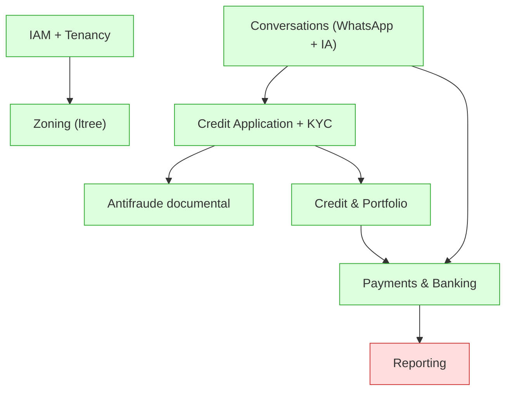
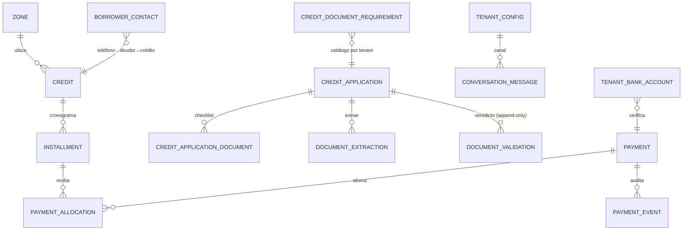
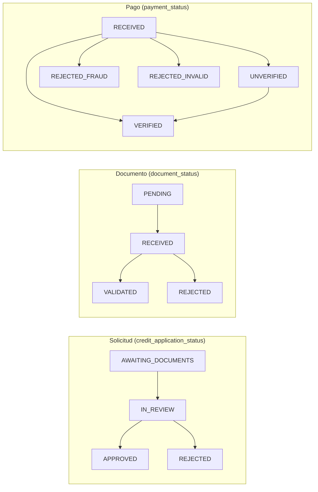
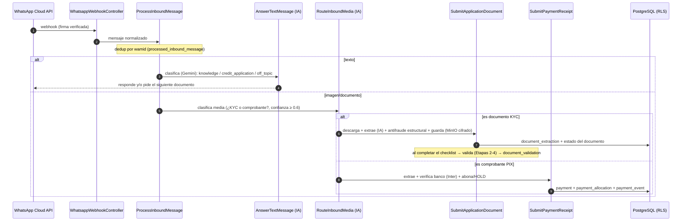

# PreztiaOS — Análisis y Diseño

> **Estado:** documento vivo. **Refleja lo que el código ya construye** (validado contra `apps/api`, `packages/{domain,application,db,contracts}`).
> **Última actualización:** 2026-06-14 (IAM por roles + Tenancy + Zoning implementados: tablas `tenant`/`collector_client`, enums `user_role`/`tenant_status`, casos de uso §10, roadmap §11).
> **Relación con los otros documentos:**
> - **[ARCHITECTURE.md](ARCHITECTURE.md)** → *cómo* construimos (principios, capas, RLS, contract-first, build/CI). Atemporal.
> - **Este documento (DESIGN.md)** → *qué* es y hace el sistema: alcance funcional, modelo de dominio, modelo de datos, máquinas de estado y flujos. Vivo.
> - **[FRONTEND_ARCHITECTURE.md](FRONTEND_ARCHITECTURE.md)** → arquitectura del cliente Expo.
> - **[analisisPlataformas.md](analisisPlataformas.md)** → *deep-dive* técnico del antifraude documental (fuentes, viabilidad, URLs).

---

## Tabla de contenido

1. [Propósito](#1-propósito)
2. [Alcance funcional y visión](#2-alcance-funcional-y-visión)
3. [Mapa de bounded contexts y estado de implementación](#3-mapa-de-bounded-contexts-y-estado-de-implementación)
4. [Modelo de dominio por contexto](#4-modelo-de-dominio-por-contexto)
5. [Modelo de datos](#5-modelo-de-datos)
6. [Máquinas de estado](#6-máquinas-de-estado)
7. [Flujo principal: WhatsApp → solicitud / KYC / pago](#7-flujo-principal-whatsapp--solicitud--kyc--pago)
8. [Pipeline antifraude documental](#8-pipeline-antifraude-documental)
9. [Pagos PIX, verificación bancaria y conciliación](#9-pagos-pix-verificación-bancaria-y-conciliación)
10. [Catálogo de casos de uso](#10-catálogo-de-casos-de-uso)
11. [Roadmap y pendientes](#11-roadmap-y-pendientes)
12. [Glosario funcional](#12-glosario-funcional)

---

## 1. Propósito

Este documento es la **base de análisis y diseño** para construir y mantener PreztiaOS, y la
**fuente de verdad funcional** de lo ya implementado. Mientras [ARCHITECTURE.md](ARCHITECTURE.md)
fija las reglas de *cómo* se escribe el código, aquí se describe *qué* hace el sistema: sus
contextos, su dominio, sus datos, sus estados y sus flujos. Todo lo de aquí está **validado
contra el código fuente**; cuando algo es plan y no código, se marca explícitamente.

---

## 2. Alcance funcional y visión

PreztiaOS es una plataforma **multi-tenant** de **préstamos y cobranza** (microcrédito de ruta /
gota a gota) con **onboarding y cobranza por WhatsApp asistidos por IA**. El recorrido real:

1. Un solicitante escribe por **WhatsApp**; un asistente de IA (Gemini) clasifica su intención y,
   si pide crédito, abre una **solicitud** y le pide los **documentos KYC** uno a uno.
2. Cada documento se **extrae con IA**, se corre el **antifraude documental** (reglas locales +
   verificación contra fuentes oficiales brasileñas) y se persiste un **veredicto auditable**.
3. Aprobada la solicitud, se **otorga el crédito** con su **cronograma de cuotas**.
4. El deudor **paga por PIX** y envía el **comprobante** por WhatsApp; se extrae, se **verifica
   contra el banco** recaudador (Inter) y se **abona a las cuotas**; lo no verificado se **concilia**
   después. Todo movimiento de dinero queda en **bitácora append-only**.

País objetivo inicial: **Brasil** (CPF/CNPJ, CEP, DDD, FEBRABAN, PIX). El diseño deja los catálogos
de documentos y proveedores **configurables por tenant**.

### Roles y menús (IAM)

Cuatro roles, dos planos. El **menú por rol** lo deciden el dominio (`domain/iam/role`) y su espejo
en el cliente (`core/auth/authorization`); la autoridad real la imponen el backend (`requireRole`/
`SuperAdminGuard` + RLS) y, por cliente, el alcance de zonas.

| Rol | Plano | Puede | Menú (app Expo, responsiva web) |
|---|---|---|---|
| **SUPER_ADMIN** | control (sin tenant) | CRUD de **tenants** y provisión de **admins** de cada tenant (no crea usuarios sin tenant) | Tenants |
| **ADMIN** | datos (su tenant) | TODO su tenant: usuarios, zonas, coordinadores, operación | Créditos · Pagos · Revisión · Usuarios · Zonas |
| **COORDINATOR** | datos (su subárbol) | operar su(s) zona(s); crear **cobradores** y asignarles clientes | Créditos · Pagos · Revisión · Cobradores |
| **COLLECTOR** | datos (clientes asignados) | ver/cobrar **solo** los clientes que le asignó su coordinador | Créditos · Mis clientes |

---

## 3. Mapa de bounded contexts y estado de implementación

| Contexto | Qué hace | Estado | Dónde vive |
|---|---|---|---|
| **IAM + Tenancy** | roles (`SUPER_ADMIN/ADMIN/COORDINATOR/COLLECTOR`), login JWT, CRUD de tenants (plano de control) y de usuarios del tenant; config por tenant (`tenant_config`) | ✅ implementado (dominio `iam` + handlers + plano de control/datos en API, verificado E2E) | `domain/iam`, `application/iam`, `apps/api/{platform,iam,auth}` |
| **Zoning** | árbol de zonas `ltree` + coordinadores; CRUD y alcance por subárbol | ✅ CRUD de zonas + asignación de coordinador + `zone-scope` (predicado ltree); `ZoneScopeGuard` materializado en consultas | `domain/iam/zone-path`, `apps/api/iam/zones*`, `db/schema/zone` |
| **Conversations (WhatsApp + IA)** | webhook idempotente, clasificación IA (Gemini), enrutamiento texto/media, transcript | ✅ implementado | `apps/api/conversations`, `domain/conversations`, `application/conversations` |
| **Credit Application + KYC** | solicitud por chat, checklist configurable, recepción y revisión de documentos, máquina de estados, eventos | ✅ implementado | `domain/credit/application`, `application/credit/application`, `apps/api/credit-application` |
| **Antifraude documental** | 9 familias de reglas locales + cruce con fuentes oficiales; veredicto con score; reporte append-only | ✅ implementado (con pruebas) | `domain/antifraud`, `application/credit/validation`, `apps/api/credit-application/validation` |
| **Borrowers (Clientes)** | registro canónico del deudor: cédula, nombre, negocio, teléfono, geo, color, cupo (límite), bloqueo de créditos y notas de cobro (append-only) | ✅ Fase 1 (dominio + handlers + API + slice Expo); ver [ROADMAP_PARIDAD_LEGADO.md](ROADMAP_PARIDAD_LEGADO.md) | `domain/borrowers`, `application/borrowers`, `apps/api/borrowers`, `apps/mobile/.../features/borrowers` |
| **Credit & Portfolio** | otorgamiento (con cupo/bloqueo del cliente), cronograma de cuotas, cartera, asignación de abonos; read-model de cuentas (deuda, cuotas pagas, días de atraso) y detalle de préstamo | ✅ dominio + repos; otorgamiento + Listado de Cuentas + Detalle por API (Fase 2) | `domain/credit/{schedule,portfolio}`, `apps/api/credit`, `apps/mobile/.../features/accounts` |
| **Payments & Banking** | comprobante PIX → extracción → verificación bancaria (Inter) → abono → conciliación; política de no verificados | ✅ implementado | `domain/credit/payment`, `application/credit/payment`, `apps/api/payments` |
| **Cash (Caja/Liquidación)** | gastos (maker-checker), liquidada (cierre de caja encadenado: caja anterior→actual, cobrado/prestado/gastos, cuentas nuevas/terminadas) y reporte diario | ✅ Fase 3 (dominio + handlers + API + slice Expo) | `domain/cash`, `application/cash`, `apps/api/cash`, `apps/mobile/.../features/cash` |
| **Operations (Solicitudes + Rutas)** | solicitud de modificación de cliente (maker-checker: cobrador propone → socio aprueba/aplica) y "Lista de cobros"/rutas (cobradores con zonas y nº de clientes, reusa Zoning+collector) | ✅ Fase 4 (dominio + handlers + API + slice Expo) | `domain/borrowers/change-request`, `application/borrowers/change-requests`, `apps/api/operations`, `apps/mobile/.../features/operations` |
| **Geo/Tracking** | recorrido GPS del cobrador, "Lugar último registro" y "Posición de Clientes" (deudores geolocalizados por estado: sin préstamos/al día/atraso) | ✅ Fase 5 (dominio + handler + API + slice Expo sin librería de mapas) | `domain/{geo/coordinate,borrowers/position}`, `application/tracking`, `apps/api/tracking`, `apps/mobile/.../features/tracking` |
| **Segmentación (Listas)** | listas personalizadas de clientes + alta masiva (el "filtro" reusa el listado de clientes) | ✅ Fase 6 | `domain/borrowers/borrower-list`, `application/borrowers/lists`, `apps/api/borrowers/borrower-list*`, `apps/mobile/.../features/lists` |
| **Config por tenant** | ajustes operativos de cobro (recargos, comisión, cupo por defecto, bloqueos); el cupo por defecto se aplica al crear cliente | ✅ Fase 7 | `domain/tenant/operational-settings`, `application/tenant/settings`, `apps/api/tenant-config`, `apps/mobile/.../features/settings` |
| **Reporting** | read-models (CQRS): panel del tenant, resumen de cliente y export CSV del listado de cuentas | ✅ Fase 8 (sin tablas nuevas; proyecta sobre cartera/pagos/caja/operación) | `apps/api/reporting`, `apps/mobile/.../features/reporting` |

> **Cableado real (NestJS):** hoy todo el flujo entra por `ConversationsModule` (webhook de WhatsApp),
> que importa `PaymentsModule` y registra los proveedores de Credit Application y Antifraude. No hay
> aún un `CreditApplicationModule` propio; `CreditController` expone el otorgamiento.

---

## 4. Modelo de dominio por contexto

Todo el dominio es **puro** (`@preztiaos/domain`, sin I/O ni framework) y está cubierto por pruebas.

### Crédito
- **`Money`** — valor inmutable en centavos; prohíbe mezclar monedas (`DomainError`).
- **`buildSchedule`** — reparte el total en `n` cuotas; **la última absorbe el redondeo**. Invariante: `Σ amountDueMinor === total`.
- **`installment` / `allocate-payment`** — estado de cuota y **asignación de un abono** a las cuotas (orden, tope `paid ≤ due`, saldo de cartera).

### Credit Application + KYC
- **`required-document`** — tipos de documento del checklist (`RequiredDocumentType`) y especificación (título/descripción/orden).
- **`credit-application`** — agregado de la solicitud: `createCreditApplication`, `nextPendingDocument`, `recordDocumentResult`, transición a *en revisión*/aprobada.
- **`document-review`** — decisión de aceptar/rechazar un documento recibido según lo que la IA identificó vs lo esperado.
- **`fraud`** — `FraudStatus` (`approved` | `suspicious` | `rejected`), vocabulario compartido con el antifraude.

### Antifraude documental (`domain/antifraud`)
Reglas puras que reciben campos ya extraídos y emiten **`ValidationAlert`** (`campo`, `severidad`, `detalle`):

| Familia | Valida |
|---|---|
| `taxpayer-id` | dígito verificador **CPF/CNPJ** (módulo 11), local |
| `identity-rules` | documento de identidad (CNH/CIN/RG/CPF): estructura + coherencia de fechas; cruce con registro CPF |
| `business-rules` | registro del negocio (Cartão CNPJ/contrato social): CNPJ válido + cruce campo a campo con la Receita |
| `utility-rules` | recibo de servicio público: FEBRABAN + fechas + CNPJ emisor vs Receita |
| `address-rules` | CEP existe y ciudad/UF coinciden; DDD del teléfono vs UF declarada |
| `cross-document` | coherencia **entre** documentos (identidad ↔ recibo ↔ QSA del negocio) |
| `febraban` | línea digitable de arrecadação (48 díg.): DV módulo 10/11 y **valor embebido** vs impreso |
| `file-forensics` | metadata técnica del archivo (Producer/Creator/EXIF, `ModifyDate` ≫ `CreateDate`) |
| `scoring` | **agrega** las alertas en un veredicto (ver §8) |

### Conversations
- **`inbound-message`** — modelo del mensaje entrante (text/audio/image/document).
- **`assistant`** — respuestas y constantes del asistente (`OFF_TOPIC_REPLY`, `ASSISTANT_UNAVAILABLE_REPLY`).

### Payments
- **`payment-review`** (`decidePaymentReview`) — decide el estado del pago a partir de extracción + verificación bancaria + antifraude.
- **`reconciliation`** (`decideReconciliation`) — decide si un pago `UNVERIFIED` se confirma/descarta al reconsultar el banco.

---

## 5. Modelo de datos

Esquema Drizzle en [packages/db/src/schema](../packages/db/src/schema). **Toda tabla de negocio
lleva `tenant_id` + RLS `FORCE`** (aislamiento; ver §8 ARCHITECTURE.md). Dinero en **unidades
menores enteras** (`*_minor`). Fechas de negocio `date`; auditoría `timestamptz`.

### Tablas

| Tabla | Propósito | Claves / invariantes notables |
|---|---|---|
| `zone`, `zone_coordinator` | árbol de zonas (`path` ltree, GiST) y coordinadores asignados | subárbol vía `path <@` |
| `credit` | crédito otorgado (capital, interés, frecuencia, fechas, estado) | `principal_minor` entero; `status` `credit_status` |
| `installment` | cuota del cronograma; los abonos acumulan en `paid_minor` | único `(credit_id, seq)`; `paid ≤ due` (dominio) |
| `credit_application` | solicitud iniciada por WhatsApp | **una activa** por `(tenant, applicant_phone)` (índice parcial) |
| `credit_application_document` | cada documento del checklist con estado y KYC | único `(application_id, document_type)`; `fraud_score`, `fraud_reasons`, `manual_review` |
| `credit_document_requirement` | **catálogo configurable por tenant** (qué documentos, orden, título, descripción para la IA) | único `(tenant, document_key)`; `active` |
| `document_extraction` | todo lo extraído por IA de un documento (trazabilidad) | `fields`/`file_metadata`/`raw_response` jsonb; `provider`/`model`; `confidence` |
| `document_validation` | **reporte antifraude append-only** (veredicto vigente = el más reciente) | `status` `validation_status`, `score`, `alerts`, `consulted_sources` |
| `processed_inbound_message` | idempotencia de webhooks (un `wamid` por tenant) | PK `(tenant_id, message_id)` |
| `credit_application_event` | bitácora append-only de la solicitud | nunca se edita/borra |
| `payment` | comprobante PIX recibido + extracción + verificación bancaria | único `(tenant, end_to_end_id)`; `payer_tax_id`/`payer_name` = **PII** |
| `payment_allocation` | porción de un pago abonada a una cuota | único `(payment_id, installment_id)` |
| `payment_event` | bitácora append-only de movimientos de dinero | nunca se edita/borra |
| `conversation_message` | transcript append-only de la conversación (in/out) | índice por `(tenant, applicant_phone, created_at)` |
| `tenant_config` | config por tenant: `whatsapp_phone_number_id`, `knowledge_base`, `ai_provider`/`ai_api_key` | PK `tenant_id`; resuelve tenant desde el webhook |
| `tenant_bank_account` | cuenta recaudadora por `(país, banco)`; `pix_key`, `api_key`, `unverified_policy` | único `(tenant, country, bank)` |
| `borrower_contact` | vínculo teléfono → deudor (búsqueda de pagos) | único `(tenant, phone)` |
| `tenant` | **tabla GLOBAL** del plano de control (su `id` ES el tenant); la gobierna el super admin | único `slug`; RLS `id = current_tenant` (un admin lee su propia fila; el control-plane BYPASSRLS gestiona todas) |
| `app_user` | usuario operador (IAM); `role` ∈ `user_role`, `zone_paths` para alcance | `email` único GLOBAL; `tenant_id` **nullable** (NULL = `SUPER_ADMIN`, plano de control) |
| `collector_client` | asignación cobrador → cliente (deudor); el cobrador solo ve sus clientes | único `(tenant, collector_id, borrower_id)`; alcance por cliente = authZ de aplicación |

### Enums (12)

`credit_status`, `frequency`, `installment_status`, `required_document`, `credit_application_status`,
`document_status`, `payment_status`, `bank_verification_status`, `validation_status`,
`conversation_direction`, `ai_provider`, `unverified_payment_policy`, `user_role`
(`SUPER_ADMIN/ADMIN/COORDINATOR/COLLECTOR`), `tenant_status` (`ACTIVE/SUSPENDED`).

---

## 6. Máquinas de estado

- **Cuota** (`installment_status`): `PENDING → PARTIALLY_PAID → PAID`; `OVERDUE` por vencimiento.
- **Crédito** (`credit_status`): `PENDING · ACTIVE · SETTLED · DEFAULTED · CANCELLED`.
- **Verificación bancaria** (`bank_verification_status`): `CONFIRMED · NOT_FOUND · UNAVAILABLE`.
- **Veredicto antifraude** (`validation_status`): `approved · suspicious · rejected` (= `FraudStatus`).
- **Política de no verificados** (`unverified_payment_policy`): `HOLD` (no abona hasta conciliar) · `ALLOCATE` (abona de inmediato con el monto extraído).

---

## 7. Flujo principal: WhatsApp → solicitud / KYC / pago

Resolución de tenant: el webhook no trae `tenant_id`; se resuelve por
`tenant_config.whatsapp_phone_number_id` (← `phone_number_id` del payload de Meta).

---

## 8. Pipeline antifraude documental

Diseño en **4 etapas** (detalle de fuentes/viabilidad/URLs en **[analisisPlataformas.md](analisisPlataformas.md)**;
ADR #13 en ARCHITECTURE.md):

1. **Etapa 1 — Extracción** (IA, persistida): campos + `file_metadata` + respuesta cruda en `document_extraction`.
2. **Etapa 2 — Antifraude local** ($0, sin red): dígito verificador CPF/CNPJ, FEBRABAN, coherencia de fechas, forense de metadata.
3. **Etapa 3 — Verificación externa** (APIs libres): Minha Receita (CNPJ), BrasilAPI CEP/DDD, cruce de identidad.
4. **Etapa 4 — APIs de pago** (opcional, futura): Serpro CPF, etc.

Se dispara **al completar el checklist** (`validate-on-completion.notifier` → `ValidateApplicationDocumentsHandler`),
que corre las reglas de `domain/antifraud` sobre las extracciones y persiste un **reporte append-only**
en `document_validation`.

**Agregación del veredicto** (`scoring.ts`, con pruebas):

| Severidad | Peso |
|---|---|
| CRÍTICA | 100 |
| ALTA | 40 |
| MEDIA | 15 |
| BAJA | 5 |

- Cualquier alerta **CRÍTICA** ⇒ `rejected`.
- Cualquier **ALTA**, o score acumulado **≥ 30** ⇒ `suspicious`.
- Sin alertas ⇒ `approved` (score 0). Score acotado a `[0, 100]`.
- **Fuentes externas caídas degradan a alerta BAJA**, no bloquean (la autenticidad la da la fuente emisora; la IA solo extrae/cruza).

---

## 9. Pagos PIX, verificación bancaria y conciliación

1. **Recepción** (`SubmitPaymentReceiptHandler`): clasifica el media como comprobante, extrae con IA
   (monto, `end_to_end_id`, pagador, banco…), guarda el binario cifrado y el comprobante en `payment`.
2. **Antifraude de pago** + **verificación bancaria**: resuelve el verificador por `(country, bank)`
   (`bank-verifier.registry` → Inter); `bank_status` ∈ `CONFIRMED/NOT_FOUND/UNAVAILABLE`.
3. **Decisión** (`decidePaymentReview`): `VERIFIED` (confirmado) / `UNVERIFIED` (banco no disponible)
   / `REJECTED_FRAUD` / `REJECTED_INVALID`.
4. **Abono** (`allocatePayment`): si `VERIFIED` (o `UNVERIFIED` con política `ALLOCATE`), reparte el
   monto en las cuotas y registra `payment_allocation` + `payment_event`. Con `HOLD`, espera.
5. **Conciliación** (`ReconcilePendingPaymentsHandler`): reconsulta el banco los `UNVERIFIED`
   (`decideReconciliation`) y abona los que se confirmen. Expuesto en el contrato `reconcilePayments`.

**Idempotencia de dinero:** un `end_to_end_id` PIX se abona **una sola vez** por tenant (índice único
parcial); los `payment_event` son la traza inmutable.

---

## 10. Catálogo de casos de uso

| Caso de uso (`@preztiaos/application`) | Resumen |
|---|---|
| `CreateTenantHandler` / `UpdateTenantHandler` / `DeleteTenantHandler` | CRUD de tenants (plano de control, super admin) |
| `CreateTenantAdminHandler` | provisiona un ADMIN vinculado a un tenant (nunca un usuario sin tenant) |
| `CreateUserHandler` / `UpdateUserHandler` / `DeactivateUserHandler` | CRUD de usuarios del tenant con jerarquía de provisión y alcance por zonas |
| `CreateZoneHandler` / `UpdateZoneHandler` / `DeleteZoneHandler` / `AssignCoordinatorHandler` | CRUD del árbol de zonas (ltree) y asignación de coordinadores |
| `AssignCollectorClientsHandler` | el coordinador reemplaza la cartera de clientes de un cobrador |
| `GrantCreditHandler` | otorga un crédito y genera el cronograma de cuotas |
| `StartCreditApplicationHandler` | abre/reanuda/reinicia una solicitud por chat y pide el primer documento |
| `SubmitApplicationDocumentHandler` | recibe un documento, lo revisa con IA, corre antifraude estructural, lo guarda y avanza el checklist |
| `ValidateApplicationDocumentsHandler` | al completar, corre el antifraude documental (Etapas 2-4) y persiste el veredicto |
| `SubmitPaymentReceiptHandler` | procesa un comprobante PIX: extrae, verifica banco, abona o retiene |
| `ReconcilePendingPaymentsHandler` | reconcilia los pagos `UNVERIFIED` contra el banco |
| `ProcessInboundMessageHandler` | clasifica el mensaje entrante y lo enruta (texto/audio/imagen/documento) |
| `RouteInboundMediaHandler` | decide si un media es documento KYC o comprobante de pago |
| `AnswerTextMessageHandler` | responde texto con IA (base de conocimiento / apertura de solicitud / off-topic) y recuerda documentos pendientes |

---

## 11. Roadmap y pendientes

Orden sugerido (cada uno: spec Gherkin → prueba de dominio → implementación):

1. **Reporting** — read models (CQRS) para dashboards y mapa.
2. **Idempotencia/audit transversales** — `Idempotency-Key` en endpoints de dinero y `audit_log` global (más allá de los `*_event` por contexto).
3. **`tenantMiddleware` por JWT** — derivar el `tenantId` del token en el middleware (hoy lo liga el `JwtGuard`).
4. **Pruebas de aislamiento de tenant** (Testcontainers) como status check de CI.

Implementado y operativo: **IAM por roles + Tenancy** (super admin/admin/coordinador/cobrador, login JWT, CRUD de tenants/usuarios/zonas, asignación cobrador→clientes), **Zoning** (CRUD ltree + coordinadores + alcance), Conversations, Credit Application + KYC, Antifraude documental, Payments & Banking, Credit & Portfolio.

---

## 12. Glosario funcional

Términos transversales en [§22 de ARCHITECTURE.md](ARCHITECTURE.md#22-glosario). Específicos de diseño:

| Término | Definición |
|---|---|
| **Solicitud (credit application)** | proceso KYC iniciado por WhatsApp que recolecta y valida los documentos antes de otorgar. |
| **Checklist / catálogo de documentos** | conjunto configurable por tenant (`credit_document_requirement`) de documentos exigidos, con orden y descripción para la IA. |
| **Extracción** | datos que la IA obtiene de un documento (`document_extraction`), base de trazabilidad y antifraude. |
| **Veredicto antifraude** | resultado agregado (`approved/suspicious/rejected` + score) persistido append-only en `document_validation`. |
| **Comprobante (PIX)** | imagen/PDF del pago que envía el deudor; se extrae y verifica contra el banco. |
| **Conciliación** | reproceso de pagos `UNVERIFIED` para confirmarlos contra el banco recaudador. |
| **Política de no verificados** | `HOLD`/`ALLOCATE`: si abonar o no un pago cuyo banco aún no confirma. |
| **Canal** | `phone_number_id` del WhatsApp Business del tenant; resuelve el tenant desde el webhook. |
